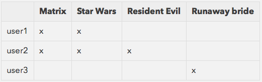
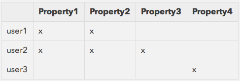

In this blog post I'll show how to build a simple recommendation engine for apartments. What are the possible design choices, how to implement them in practice, and how to validate the performance of your system.

<!--more-->

### Introduction

At HouseTrip you can find the perfect place for your next holiday over a set of more than 300,000 properties all over the world. Searching inside such a large set of properties can be at time overwhelming, doesn't matter how good the search experience is within your system.

Recommender Systems are considered a solid and effective solution to this problem. They complement the search experience of the website by suggesting items that are relevant to the user.

In this blog post we show how to build a simple property recommendation engine. What are the possible design choices, how to implement them in practice, and how to validate the performance of your system.

### A bit of history

The Recommender systems field is more than 20 years old. The first system relying on this technology was built by Xerox in 1992 \[1\]. Few years later the GroupLens research team at University of Minnesota built the first article recommendation system \[2\] and the first movie recommender system \[3\]. But it's starting from the early 2000 that the technology is actively used in several commercial websites, like Amazon and Netflix. Today the ACM conference on Recommender Systems \[4\] is held yearly and the interest from the community is constantly increasing.

### The theory

Recommender Systems can be divided in three categories \[5\] depending on the type of algorithm they rely on:

- Content-based filtering
- Collaborative filtering
- Hybrid recommender systems

Let's assume that we have to build a movie recommendation engine. In a **content-based approach** you first formalise the dimensions of your items. In our example a movie can be represented as a set of genres, e.g. the _Matrix_ movie is equivalent to the vector _\[Action, Sci-Fi\]_. Once you have this representation in place (and as you can imagine it may be far from trivial \[6\]) you can infer the profile of your users by looking at the vectors of the movies they watched. At this point you can search all the movies whose vector is _close_ to the one representing the profile of your user and return them.

Let's now focus on two characteristics of this approach: (i) If your domain model does not include a particular dimension, there is no way your system can output recommendations matching this dimension. In the previous example since we didn't include the list of actors in the movie description the system will not be able to return good recommendations for people interested in a very specific actor; (ii) Recommendations are likely to suffer of _over specialization_ , i.e. the system will never return unexpected exploratory results since it's only able to match the user profile.

In a **collaborative filtering** approach the rules of the algorithm are completely different. You don't formalise the domain dimension of your items but you use the data of your users to compute the similarities. You start with a matrix of data with users and items like the one that follows:



In this example the data represents the fact that a particular user has watched a certain item. Of course more complicated scenarios are possible (user providing _ratings_ for example) but let's keep it simple for the moment. Looking at the matrix it is clear that _user1_ and _user2_ share similar tastes, while _user3_ belongs to a different category. To build the movie recommendations for _user1_ you must retrieve the users that are most similar to him (_user2_) and then use the movies they like for the recommendations. In this example a collaborative filtering approach will recommend _Resident Evil_ to _user1_ because of its similarity to _user2_. Let's now focus on two characteristics of this approach: (i) the system is not able to produce recommendations for users who didn't rate any item. This is also known as the _cold start_ problem. (ii) top recommendations will be a function of what the majority of the users thinks, which may be good or bad depending on your specific scenario.

**Collaborative filtering** approaches can be further divided in two subsets: _memory based_ and _model based_. The first one mostly relies on algebraic rules to compute the distances over the _user/item_ matrix. The second one relies on data mining and machine learning approaches to build models of the data that can be exploited to provide the recommendations. Historically _memory based_ approaches are considered simple and effective, and this is the type we will focus on for the rest of this post.

To conclude this overview, **Hybrid recommender systems** combines both the previous approaches to overcome their limitations. In 2007 the algorithm winning the Netflix prize for better movie recommendations \[7\] combined 107 different algorithmic approaches into one solution.

### Computing recommendations

In this section we will explain how to compute property recommendations using a _memory-based collaborative filtering_ approach. We believe this is the best solution to experiment with here at HouseTrip because we don't need to build (and maintain) a complex domain model of our items, and we have enough data to rely on a collaborative filtering approach that, despite its simplicity, is historically considered a simple and effective solution \[5\].

The data we will be working with looks as follow:



The point in the matrix can be a user visiting the page of a property, or it could be an enquiry made by a guest to stay in the property. To compute the similarities between the properties we need to iterate over the properties with this simple algorithm:

```
recommendations = {}
Property.all.each do |a|
  users_for_a = [...]
  
  Property.all.each do |b|
    users_for_b = [...]
    users_for_a_and_b = users_for_a & users_for_b   

    recommendations[a.id] ||= {}
    recommendations[a.id][b.id] = users_for_a_and_b.size 
  end
end
```

Unfortunately the algorithm is trivially `O(n^2)`. You can still refine it by caching some information instead of going directly to the database, or by improving the queries to only load the properties belonging to the same region. We implemented the above mentioned improvements and we ran it on a development machine running on top of _Ruby2_, _ActiveRecord_ and _MySql_ database. In this scenario computing the recommendations for a single property takes around 17 seconds. This means that if we need to compute the recommendations for all the properties in London - 6000 properties in my development environment - it would take around 1.2 days.

### Exploiting parallelism

In this section we will explain how to run the simple collaborative filtering algorithm described previously using the MapReduce paradigm.

Using the Hadoop framework \[8\] it is possible to build MapReduce workflows using a variety of different languages. If your task is specifically to run some well-known data mining algorithm in parallel, then there is a set of pre-built solutions made for you and packaged in the Mahout library \[9\]. Mahout also includes some configurable collaborative filtering algorithm, however in order to have the highest degree of flexibility we decided to build our own.

Translating an algorithm into a series of MapReduce steps is usually far from trivial. If you want to rely on a higher level of abstraction then the Pig scripting language \[10\] is an indispensable tool to master. A script written in Pig can be automatically translated into a series of MapReduce steps terribly simplifying the job of understanding and maintaining your workflow.

The Pig script we used is shown in the appendix of this document. Here we will present what it does conceptually. We assume to start with a set of enquiries extracted from the database. That list is simply made of tuples `&lt;user, property&gt;` like the following one:

```
(u_a, p_h), (u_b, p_k), ....
```

Starting from this list the first step that you want to do is to group the list by user, which leads to the following:

```
u_a: [ p_a1, p_a2, .... p_an ]
u_b: [ p_b1, p_b2, .... p_bm ]
...

```

where `[ p_a1, p_a2, .... p_an ]` is the list of properties for which `u_a` have made an enquiry. Once you reach this state the goal is to compute for each user all the possible permutations of size 2 of the properties they enquired. Intuitively each of these tuples represent the fact that one property is - to some extent - similar to another.

```
(p_a1, p_a2)
...
(p_a1, p_an)
(p_a2, p_a1)
...
(p_a2, p_an)
(p_b1, p_b2)
...

```

You may have noticed already that after you build this list it is very likely that you will find repetitions. Two tuples here are equal if two users have both enquired the same two properties. Therefore we can proceed to the next step which is grouping those tuples and count them, which leads to the following state:

```
(p_h, p_k, c_hk)
...
(p_i, p_j, c_ij)
...

```

where `c_hk` represents how many times you found the tuple `(p_h, p_k)` in the previous list. At this point you are practically done and you can group the obtained triples within the first dimension to obtain your recommendations. The result looks as follows:

```
p_i: (p_j, c_ij), (p_k, c_ik),…
...
p_v: (p_z, c_vz), (p_w, c_vw),…
...

```

where on the left you have a property, and on the right you have the list of recommendations with the associated count. The count represent the similarity weight for the property. Therefore ordering this list gives you the topK properties we were looking for. Again, the detailed Pig script can be found in the appendix of this blog post.

In order to run the script you need to deploy an Hadoop infrastucture, or you can use the Amazon Elastic MapReduce cloud service \[11\]. The workflow of the deployment is the following:

- Export your input data (for us, property enquiries)
- Export the UDFs used in the Pig script into a Jar
- Upload the input data, the Pig script and the Jar to S3
- Launch the job (for example using the Amazon CLI)
- Download the output from S3 and feed them into your recommendations service
- Start serving requests

With this approach we have been able to process the recommendations for the entire dataset of properties in 25 minutes using 5 EC2 large instances running on top of Hadoop 2.4.0 \[12\]. It is possible to feed the algorithm with _property views_ instead of enquiries (i.e. the user visited the profile page of a property) . To do that we fed the algorithm with 4GB of apache logs over the last 3 months and we got the results in 78 minutes using the same computing power of the previous experiment. This is due to the overhead of parsing the logs before actually starting computing the recommendations.

### Validation

To validate a collaborative filtering algorithm we can look at its _coverage_ and at its _accuracy_ as suggested in \[15\].

We found that the _coverage_ varies significantly depending on the dataset we use to feed the algorithm. By using _property enquiries_ we got a coverage of _71%_ over searcheable properties in our top 10 destination in the website. By using _property views_ we got a coverage of just _40%_ with 3 months of data. To increase the coverage in this case we can increase the window of the dataset, but this is left to future works.

To complete our validation we assessed that the properties are actually similar by measuring the absolute difference in terms of _maximum number of people_, _price_, and _geographical distance_ between each property and its recommendation set. The results gave use clear evidence that the properties are indeed _similar_ and that top recommendations are significantly _closer_ to the target property in terms of the previously mentioned distance measure.

Finally, the _accuracy_ can be evaluated at runtime on the system by looking at the _click through rate_ of the recommendations. We did not performed this evaluation yet and it is left as a future work.

### Conclusions

In this blog post we presented how to compute property recommendations using a _memory-based collaborative filtering_ approach. We presented how the algorithm is implemented locally and what is needed in order to run it in parallel using a MapReduce cloud infrastructure. Finally we validated the quality of our recommendations in terms of coverage and similarity using a simple heuristic measure. Future works include validating the performance with real user data, and the extension of the algorithm to work in conjunction with a content-based approach.

### Appendix

This is the Pig script implementing the informal algorithm presented previously. The `ht.udf.Permutations` function is a simple UDF function \[13\] to compute all the possible permutations of size 2 of a given set of elements. If you are interested in examples of UDFs we suggest to have a look at the Piggybank library \[14\].

```
REGISTER '$htjar';
pre1 = load '$input' USING PigStorage(',') AS (user_id: int, property_id: int);

/* Multiple hits to the same resource does not count */
pre2 = DISTINCT pre1; 

/* Collect the hits for each user */
r2 = GROUP pre2 by user_id; 

/* Clean the bag */
r3 = FOREACH r2 GENERATE pre2.property_id; 

/* Generate all the possible <p_i, p_j> permutations */
r4 = FOREACH r3 GENERATE ht.udf.Permutations($0);

/* Clean the bag */ 
r5 = FOREACH r4 GENERATE FLATTEN($0); 

/* Group the occurrences of each <p_i, p_j> touple */
r6 = GROUP r5 BY ($0,$1); 

/* Count the occurrences of each <p_i, p_j> couple and generate the triple <p_i, p_j, count> */
r7 = FOREACH r6 GENERATE $0.$0, $0.$1, COUNT($1); 

/* Group the triples <p_i, p_j, count> using the first dimension obtaining <p_i, (<p_i, p_j, count>, ... <p_i, p_k, count>)> */
r8 = GROUP r7 BY $0; 

/* Clean and order the collected triples <p_i, (<p_j, max_count>, ... <p_k, min_count>)> */
r9 = FOREACH r8 { 
  ordered = ORDER r7 BY $2 DESC; 
  ordered_prj = FOREACH ordered GENERATE $1, $2; 
  GENERATE $0, ordered_prj; 
}; 

/* Store the result */
rmf $output;
store r9 into '$output';
```

It is possible to test this script using the PigUnit library as follows:

```
@Test
public void run_on_AR() throws Exception {
    String[] args = {
        "input=src/test/resources/property_recommender_test/log_on_ar.txt",
        "output=src/test/resources/property_recommender_test/out",
        "htjar=target/PropertyRecommender-0.0.1-SNAPSHOT.jar" 
    };

    PigTest pigTest = new PigTest("src/main/resources/property_recommender_on_AR.pig", args);

    pigTest.assertOutput("pre1", new String[] { 
        "(111,1101)",
        "(111,1101)",
        "(111,1102)", 
        "(111,1103)", 
        "(222,2201)",
        "(222,2202)", 
        "(222,1101)", 
        "(333,3301)",
        "(333,2201)", 
        "(333,1101)" 
    });

    pigTest.assertOutput( "r9", new String[] {
        "((1101),{((2201),2),((1103),1),((1102),1),((2202),1),((3301),1)})",
        "((1102),{((1101),1),((1103),1)})",
        "((1103),{((1101),1),((1102),1)})",
        "((2201),{((1101),2),((2202),1),((3301),1)})",
        "((2202),{((1101),1),((2201),1)})",
        "((3301),{((1101),1),((2201),1)})" 
    });
}
```

As you can see this is an integration test where we load some test input and we assert that our output relation contains the data we expect. This turned out to be very useful during the development to gain confidence that the script was working without the need to test it manually on a running local pig console.

### References

1\. Using collaborative filtering to weave an information Tapestry 2\. GroupLens: an open architecture for collaborative filtering of netnews 3\. MovieLens 4\. ACM Conference on Recommender Systems 5\. Recommender Systems handbook 6\. The Pandora Music Genome Project 7\. The Netflix prize 8\. Apache Hadoop homepage 9\. Apache Mahout homepage 10\. Apache Pig homepage 11\. Amazon Elastic MapReduce homepage 12\. Amazon Machine Images for Elastic MapReduce 13\. Pig UDF functions Wiki 14\. Piggybank UDF collection Wiki 15\. An algorithmic framework for performing collaborative filtering

### Credits

The original blog post has been published in the Housetrip developers blog for which I currently work.
