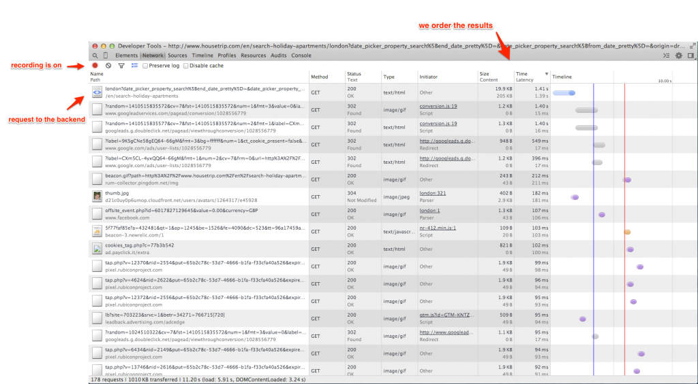
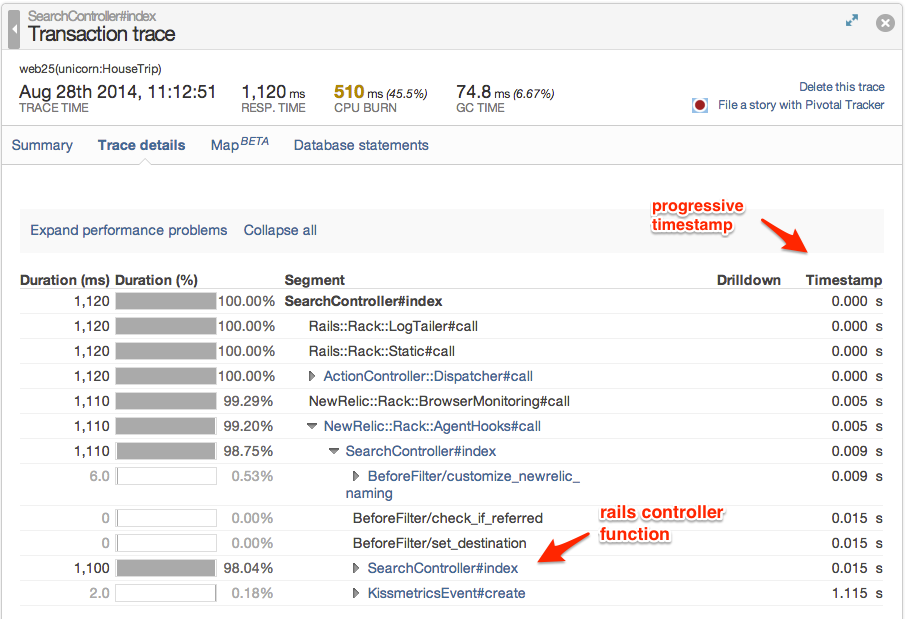
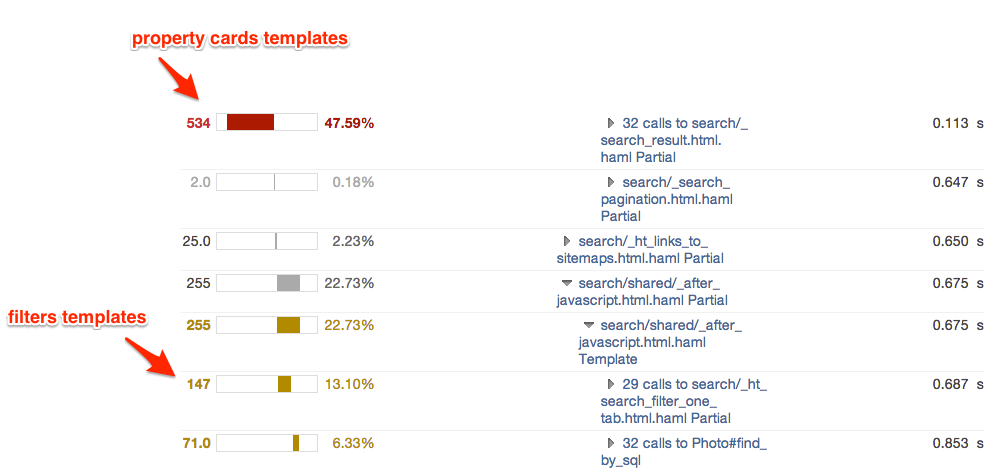
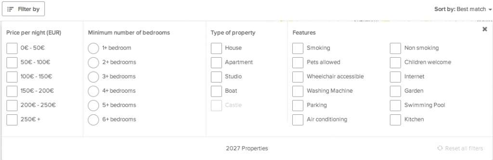

Fast web apps are beautiful to use and are one of the key requirements for a successful user experience. Not only, if you are running an e-commerce business being faster also have a great impact on revenue. Here I will show you how to analyze and speedup the performance of your web app for two common scenarios using a real world example.

<!--more-->

## Identify the bottlenecks

Recently at HouseTrip I was working on optimizing the response time of the search page. Let's see how I approached the problem, the tools I used, and the final solution I got.

First we need clear evidence of what are our performance bottlenecks. This is a key step for a successful optimization; if you know your bottlenecks and their corresponding impact you can built an optimization plan that will prioritize them.

My investigation usually starts from the browser. This is what your end user is relying on and this is where you can get an immediate feeling of what's wrong with your page. The Google Chrome developer tools can give you an impressive amount of actionable information.

Let's open the dev tools and go to the network panel. Turn the recording on, load your page, and order the requests by response time. We should see something that looks like this:



We now have a clear picture of what's going on. In this case the backend is the biggest bottleneck within the set of requests that happen in our page. It's definitely a good idea to dig deeper and see why this is taking so long.

To analyze the performance of our backend we can use New Relic but in theory anything that is able to record the execution time of your backend code would work. To me the most helpful feature is the "transactions monitoring". Here I can look at my endpoints and inspect sample execution traces that I can analyze up to the function level. In the following picture you can see the same endpoint that we hit from the browser and the corresponding execution time. With no big surprises all the time is spent in the controller.



Digging deeper into the execution trace we can find all the information we need. Here I will focus on two elements that caught my eye and that are shown in the picture that follows.

- The first one is that we are spending a lot of time in rendering some partials. On top of all the properties list followed by the filters.
- The second one is that we are issuing lots of extra queries to retrieve the default photo of each property.



### Speeding up the page

Now that we know what are elements slowing down our page we can start thinking about how to fix them. Luckily for us solutions for the above mentioned problems are well known and easy to implement.

To speed up the template rendering we can use some simple caching mechanism. One of the templates that was easy to cache in our case was the filters template that looks as follows:



This is easy to cache because the information in the template is almost static. Each filter can be selected/not-selected, it can be grayed out, and it could be in a number of different locales. Apart from these combinations the content of the filters is static and does not vary over time. The cache key for the template will look as follows:

```
Digest::SHA1.hexdigest([name, selection, I18n.locale, CACHE_GENERATION].join('|'))
```

where `name` is the filter column we are caching (price, apartment type, etc.), `selection` is the set of currently selected options for this filter column, `I18n.locale` is the locale, and finally `CACHE_GENERATION` is the generation of our cache which is useful if you want to expire the cache for any reason.

Now we are left with the problems of the extra queries for each property to retrieve the photo. When we retrieve the set of properties in the search result page each property has a default photo associated. This information is stored in a separate table and if you simply run:

```
p = Property.where(title: 'Great beach house')
p.default_photo
```

this is going to generate two queries. One to retrieve the property, and the second one to retrieve the photo. Luckily there is an easy solution to this problem. We can simply pre-load the default\_photo information by using the active record `include` option (see docs) as follows:

```
p = Property.includes(:default_photo).where(title: 'Great beach house')
p.default_photo
```

Now our model is going to preload in memory the information related to the `default_photo` and you will not need an extra query when you issue the `p.default_photo` instruction.

These two very simple fixes gave us a `20%` improvement on the search page response time and we can get much more by further caching the properties templates. These represents another `40%-50%` of the response time but are not as static as the filters and therefore are less trivial to be cached.

### Conclusions

Optimizing your web app is not a trivial job. It requires a lot of investigation before you can actually find what are the main performance bottlenecks affecting it. Here I presented the entire journey to identify and solve two of the most common performance bottlenecks in your web app: (i) Template rendering and (ii) inefficient SQL queries due to the object-relational mapping. I used a real world example I worked on at HouseTrip to present the solution.

In general it could be way more difficult than what I presented here. For example if your database is suffering from high load then you probably need to re-think your system architecture. Luckily what I just presented here should cover the vast majority of cases.

Hope you enjoyed the journey and that you are looking forward to jumping back to your app and speeding it up!

### Credits

The original blog post has been published in the Housetrip developers blog for which I currently work.
