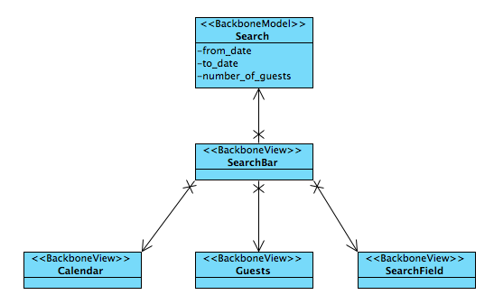
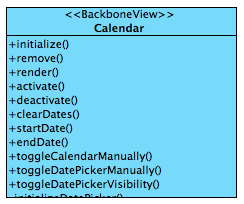
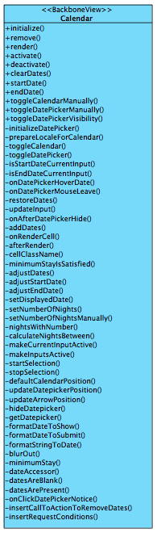
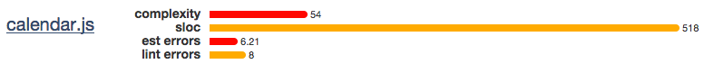
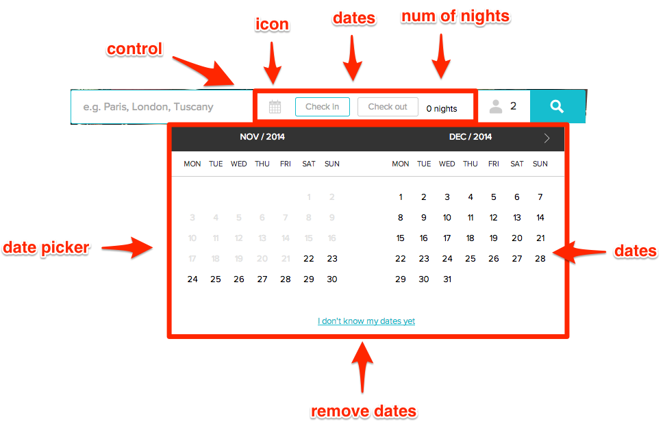
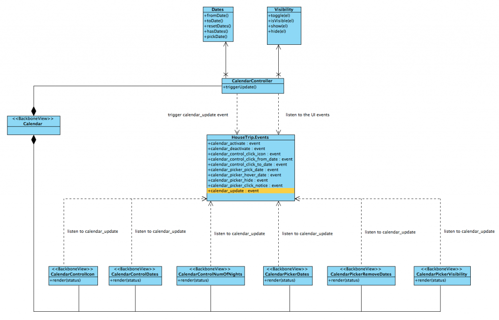
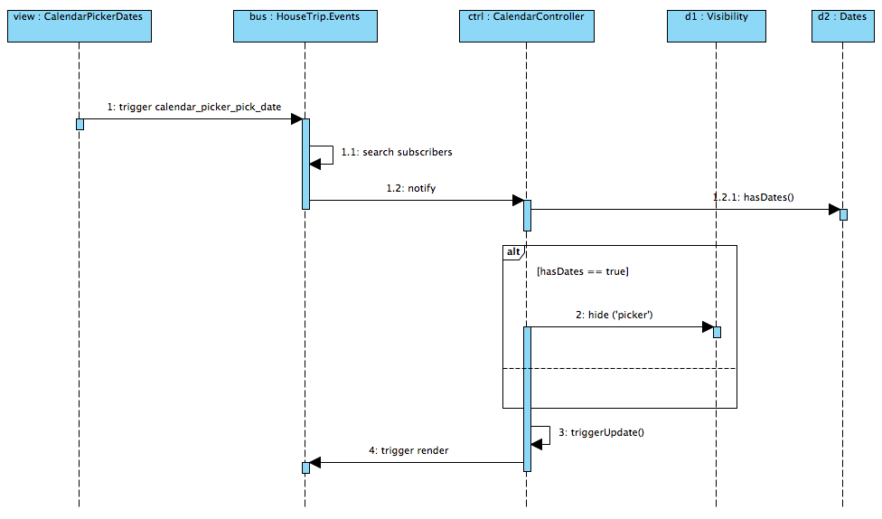
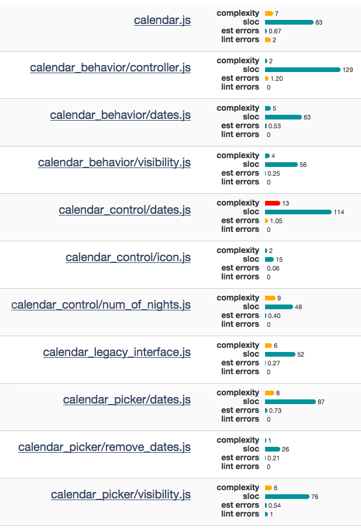

Frontend components are hard to implement and more often than not the code reflects this complexity. In this blog post I will show you how I refactored the code of a complex frontend calendar sharing some of the findings that led to a cleaner implementation.

<!--more-->

First I'll give you a quick overview of the calendar I am going to refactor. Then I will show you the first implementation together with some metrics demonstrating why I was not happy about it. Starting from here I will present how I refactored the code following some well know design principles. The resulting code is evaluated against the same metrics used for the first implementation.

## Visual design

HouseTrip is a revolutionary holiday rental website where you can book a whole home for less than the price of a hotel room. When you land on the homepage you promptly get asked to enter the **destination** of your holiday, the **dates** and the **number of people**. The date selection functionality is offered by the calendar I am presenting here.


As you can see the calendar does not live _alone_ but it's inserted in the context of a _search bar_. All the elements of the search bar can be _active_ or _inactive_. An element is in its _active_ state if the user is currently interacting with it, the element is in the _inactive_ state otherwise. When you open the home page the calendar is in its _inactive_ state. In this state only the calendar icon is visible, as shown here:


As soon as you click on the calendar icon the calendar goes into its _active_ state. In such state the _date picker_ is open and it's possible to select the _start date_ of your journey as shown here:


When the user click on the start date the date box in the search bar is updated with the selected date and the active date is moved to the end date as shown here:


At this point the user can choose the end date, bringing the calendar to the following state:


Notice that when the user is hovering a date but haven't chosen it yet, the corresponding box is highlighted with the hovered date, as shown here:


After the date selection is finished the _date picker_ is closed and the search bar displays the selected dates in the corresponding boxes as follows:


Hopefully this is enough to give you an idea of the functionality provided by this calendar. Let's now dig into the details of how this has been implemented, and why we decided to refactor it.

## The Iceberg Class

As I said the goal was to refactor the existing calendar, so let's have a look at the overall design of the existing component as I found it. To better understand it, let me enlarge the picture for one second and let's see what the overall search bar looks like:



there is one _backbone model_ containing the information regarding the search that must be performed, and three sub-views holding the responsibilities of the three visual elements in the bar. Up to here nothing surprising, but let's dig into the design of the calendar.

The public interface includes methods to _activate()_ and _deactivate()_ the calendar. The calendar is _active_ when it's the currently opened element in the _search bar_ interface, _inactive_ otherwise. _startDate()_ and _endDate()_ return the currently selected dates, while _clearDates()_ reset your selection. _toggleCalendarManually()_, _toggleDatePickerManually()_ and _toggleDatePickerVisibility()_ can be used to open/close the picker, and set the calendar to the active/inactive states explicitly.



The one above is arguably not the best public interface ever, but this is not our major problem. In fact the class itself is a quite big entity of **500+** lines of codes handling all the responsibilities related to the states that I described in the visual design. Here you can see the complete list of methods:



This is what I usually define as an **iceberg class**. It is my personal belief that in the agile world these kind of classes arise quite easily. Developers start a component that is small and sounds reasonable, and each time a _story_ adds a new requirements, a number of helper methods are piled up hiding important responsibilities and cluttering the code. Empirically I would say that when the number of private methods becomes greater than 10, this is the definition of an _iceberg class_. In this magnificent specimen we can count 44 private methods.

## Code Quality Evaluation

To many people it is probably obvious why this class is not an acceptable implementation, but I would like to use well known metrics to actually prove it. In order to assess the code quality I usually rely on the following empirical classification:

- **Highly Cohesive**: the concepts expressed in the class are tightly connected.
- **Loosely Coupled**: the class does not heavily rely on other ones.
- **Easily Composable**: the class facilitates composition.
- **Context Independent**: the class has no built-in knowledge about the system in which it executes.

These principles has been perfectly summarized in the S. Metz talk at GORUCO Conference. Coupling and Cohesion were actually invented by Larry Constantine in the late 1960s as part of Structured Design even before OOP was invented. Easily Composable and Context Independent have been added by Freeman S. and Pryce N. in Growing Object-Oriented Software, Guided by Tests. Simply said, objects should be like Legos.

Arguably the calendar class that I just showed is violating most of these principles. It is definitely not highly cohesive since it contains terms from domains that do not strictly belong to the calendar like the private method _minimumStayIsSatisfied()_. Arguably it does not heavily violate the _Loosely Coupled_ principle since the only explicit dependency it has is the Foxrun DatePicker plugin it relies on. Definitely it is not context independent since it's public API assumes that the calendar lives inside the _search bar_ and therefore has an active/inactive state. For the same reason the _Easily Composable_ metric is heavily affected.

To complete the above assessment let's see what an empirical code quality library like https://github.com/es-analysis/plato tells us:



Plato is not able to catch the soft details that we made explicit with the previous analysis. Nevertheless it is clear that there is an impact on _complexity_ and _estimated probability of errors_. A more detailed report also highlights that the most offensive methods are the _render()_ method (SLOC = 35) and the _onDatepickerHoverDate()_ method (SLOC = 9).

## Refactoring

In order to get this calendar back in shape we need a plan. This is how I approached the problem:

- Identify and the **presentation layer**, the **application layer** and the **domain layer**.
- For each layer identify a set of single responsibilities classes.
- Design the interactions between the classes trying to constantly minimize the dependencies between them.

The concepts of _presentation layer_, _application layer_ and _domain layer_ have been perfectly described in Domain Driven Design by E. Evans. It is definitely a general purpose technique and can be applied to your software no matter the language you use and (often) the granularity of the code you are working on. The _presentation layer_ in the calendar is expressed in terms of Backbone views. Each backbone view is bound to a single visual element of the calendar. By carefully analyzing the calendar we can actually find quite a number of entities that were "hidden" in the previous design and that are now highlighted here:



You can identify two main areas in the calendar: the _control_ area and the _date picker_ area. These will be represented in the code by simple package namespacing. Inside each area we can identify visual components with single responsibilities: for the _control_ we have the _calendar icon_, the _dates boxes_ and the _number of nights_; for the _date picker_ we have the _dates_ and the _remove dates_ action. The _dates_ are handled using the foxrun datepicker library, so we don't have to go deeper than that. A trickier responsibility that I identified later was a backbone view that is responsible to make the picker visible or not, you will see the class in the design that follows shortly.

The _application layer_ defines the jobs the software is supposed to do and directs the expressive domain objects to work out problems. To achieve these goals I created a _calendar controller_ class that is responsible to (i) receive UI events, (ii) orchestrate the domain objects and (iii) notify the views of the updates. This is closely if not perfectly matching an MVC pattern, hence the name I gave to the class. This is also the moment in which I needed to carefully think about the communication between the presentation layer and the application layer. For this boundary I wanted the highest degree of decoupling available since the change between this border is very likely to happen. Hence I went through the path of a pub/sub event dispatching mechanism.

In the _domain layer_ I identified two classes based on the high-level requirements for the calendar. The first one is obviously the dates. The second one is (less obviously) the _visibility_ of the _control_ and _date picker_ elements in the UI. At a first glance it may look like a view responsibility, but then working on the code I realised that one responsibility is _how_ the visibility status is reflected in the DOM (i.e., the view) and another responsibility is the abstract status of the visual element itself (i.e., the domain model). This is definitely a not straightforward separation and I think it's open to interpretation.

Finally the original _calendar_ class now has the responsibility to compose the previously presented elements. The complete class diagram of the design is shown here:



The typical interaction starts from the user clicking on some UI element. The backbone view associated to this area of the DOM captures the UI event and triggers the corresponding pub/sub event in the _HouseTrip.events_ bus. The controller is subscribed to all the calendar events and works out what it should do for each of them by orchestrating the domain objects. Finally, the controller trigger a _calendar:update_ event to which the views are subscribed. This event provides a _status_ object that _serialise_ the domain entities to be read by the view. This is a maybe unnecessary indirection that I introduced but I found it useful to separate the domain objects from the information needed by the views to be rendered. You can find the details in the controller code shown in the next section.

An example of interactions between these objects is shown in the sequence diagram underneath which starts when the user selects a date from the picker panel:



Note the business rule managed by the _controller_: if the user picks a date and both the _from date_ and _to date_ fields are present, hide the picker. Arguably, the if statement in the controller is the responsibility of a _service object_, but in this case it's so simple that would be ridiculous to add it.

## Evaluate the new design

To evaluate the design let's go back to the principles and evaluate the degree of cohesiveness, coupling, composability and context independence for some key classes we produced. The first one is the calendar which simply acts as a composition mechanism. Here in the constructor we can see the elements we discussed:

```
HouseTrip.Views.SearchBarCalendar = Backbone.View.extend({
  initialize: function() {
    this.calendarIcon = new HouseTrip.Views.SearchBarCalendarControlIcon({
      el: this.$('.calendar-icon')
    });

    this.dates = new HouseTrip.Views.SearchBarCalendarControlDates({
      el: this.$('.calendar-control-dates')
    });

    this.numOfNights = new HouseTrip.Views.SearchBarCalendarControlNumOfNights({
      el: this.$('.calendar-control-nights')
    });

    this.visibility = new HouseTrip.Views.SearchBarCalendarPickerVisibility({
      el: this.$('.date-picker')
    });

    this.dates = new HouseTrip.Views.SearchBarCalendarPickerDates({
      el: this.$('.date-picker')
    });

    this.removeDates = new HouseTrip.Views.SearchBarCalendarPickerRemoveDates({
      el: this.$('.date-picker')
    });

    // ...some more code
  },

  render: function() {
    this.behavior.triggerUpdate();
  }

  // ...some more code
});

_.extend(HouseTrip.Views.SearchBarCalendar.prototype, HouseTrip.Helpers.Delegation);
```

Here, arguably, we achieved a pretty good degree of _cohesiveness_ and _composability_ which are order of magnitudes above the previous implementation. In terms of coupling this class is only creating the sub-views but actually does not rely on them, so I am also confident that this is _loosely coupled_. On the other hand I don't think this class is context independent and this is why it is namespaced under _SearchBar_.

Let's look at the controller now:

```
HouseTrip.SearchBarCalendarController = function() {
  this.initialize();
};

HouseTrip.SearchBarCalendarController.prototype = _.extend({

  initialize: function() {
    this.dates = new HouseTrip.SearchBarCalendarDates();
    this.visibility = new HouseTrip.SearchBarCalendarVisibility();

    HouseTrip.Events.on('search_bar:calendar:activate', this._onActivate, this);
    HouseTrip.Events.on('search_bar:calendar:deactivate', this._onDeactivate, this);

    HouseTrip.Events.on('search_bar:calendar:control:click_calendar_icon', this._onClickCalendarIcon, this);
    HouseTrip.Events.on('search_bar:calendar:control:click_from_date', this._onClickFromDate, this);
    HouseTrip.Events.on('search_bar:calendar:control:click_to_date', this._onClickToDate, this);

    HouseTrip.Events.on('search_bar:calendar:picker:pick_date', this._onPickDate, this);
    HouseTrip.Events.on('search_bar:calendar:picker:hover_date', this._onHoverDate, this);
    HouseTrip.Events.on('search_bar:calendar:picker:hide', this._onPickerHide, this);
    HouseTrip.Events.on('search_bar:calendar:picker:click_notice', this._onClickNotice, this);
  },

  triggerUpdate: function(event) {
    var status = {
      active: this.visibility.isVisible('active'),
      controlVisible: this.visibility.isVisible('control'),
      pickerVisible: this.visibility.isVisible('picker'),
      fromDate: this.dates.fromDate(),
      toDate: this.dates.toDate(),
      onFromDate: this.dates.is('onFromDate'),
      onToDate: this.dates.is('onToDate')
      // ...some more attributes for hovering state
    };

    HouseTrip.Events.trigger('search_bar:calendar:update', status);
  },

  _onPickDate: function(date) {
    this.dates.pickDate(date);

    if(this.dates.hasDates()) {
      this.visibility.hide('picker');
    }

    this.triggerUpdate('onPickDate');
  }

  // ...some more code

}, Backbone.Events);

```

I omitted most of the functions since they all do more all less what the _\_onPickDate()_ method is doing. If we evaluate this code based on the previous principle, arguably we can say that: (i) is highly cohesive, because all the verbs involved map UI events to domain elements. Nothing more than that; (ii) is _somehow_ loosely coupled since it heavily depends on the domain elements (expected), but it's not strictly tight with the views; (iii) _composability_ and _context independence_ are tricky to evaluate for controllers but in my opinion we didn't made any clear errors here. If you have comments on that I would be happy to hear them.

Finally, this is the view for the number of nights:

```
HouseTrip.Views.SearchBarCalendarControlNumOfNights = Backbone.View.extend({

  initialize: function() {
    HouseTrip.Events.on('search_bar:calendar:update', this.render, this);
  },

  render: function(status) {
    if(!status) {
      return;
    }

    this._setNumberOfNights(status.fromDate, status.toDate);

    if(status.controlVisible) {
      this._open();

    } else {
      this._close();
    }
  },

  _setNumberOfNights: function(fromDate, toDate) {
    // ...some more code to compute the difference

    this.$('.number-of-nights').text(numberOfNightsText);
  },

  _close: function() {
    this.$('.number-of-nights').hide();
  },

  _open: function() {
    this.$('.number-of-nights').show();
  }

});

```

Here I truly believe you can see the advantage of the approach. The view is _highly cohesive_ because it only speaks the language of the DOM. It is _loosely coupled_ since it only relies on the _status_ interface. It is _context independent_ because no matter where you place this view it simply needs the event to be published, and finally is _loosely coupled_ simply because it does not strictly rely on other objects.

To wrap up this evaluation let's see the updated stats that Plato provides us:



We can make some simple observations on these data:

- The SLOC are more equally distributed between the different classes. The _controller_ and the _control dates_ being the exception with slightly bigger numbers.
- The reported complexity is always low, apart from the _control dates_ view.
- In general it _seems_ (with some degree of mercy) that the classes follow the Sandi Metz rules regarding the complexity. No more than a 100 lines for each class, no more that 5 lines for each method.

You can argue that the number of classes has definitely increased and that a newcomer to the code probably needs a few minutes to review its organization before being able to change it. Despite that, I truly believe this design is easier to work with, easier to maintain, and easier to test (which is an entire different blog post, but you may already guess the advantages in this area).

## Conclusions

In this blog post I presented an overview of how I handled the design of a frontend calendar. I used well known software design principles with the end goal of maximise the qualities of the resulting classes and the separation between the different software layers of the calendar. Technologically I relied on Backbone for the views and to implement the pub/sub bus enabling the communication between the views and the controller. Finally the domain layer is only made of POJOs.

In general I am definitely happy about the resulting code. Obviously everything I presented is subject to tradeoffs and I would love to hear your feedback in the comments!

## Credits

The original blog post has been published in the Housetrip developers blog for which I currently work.
