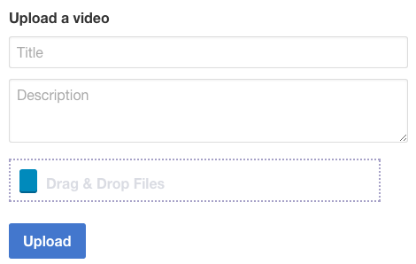

Rails does not help much when dealing with AJAX uploads by means of external JS libraries. I recently came across a case where a user on www.codementor.io was struggling to use JQuery-upload-file to upload a video to a Rails backend. The main reason to use the library was the progress bar feature, something that is missing in the Rails world. In this blog post I'll show you how to implement the functionality in the simplest case possible.

<!--more-->

The interface looks as follows: 

The view looks like follow:

```
= form_for @movie do |m|
  = m.text_field :title, placeholder: 'Title'
  = m.text_area :description, placeholder: 'Description', rows: '3'
  = m.file_field :video
  = m.submit 'Upload', id: 'fileUpload', data: { disable_with: 'Uploading' }
```

As you can imagine there is a Movie model in the backend ready to be created. The **data: { disable\_with: 'Uploading' }** bit will disable the button when we submit our form. The actual form submission will be handled by **jquery-upload-file**.

On the JS code this is what we need now:

```
$(document).ready(function() {
 var uploadObj = $("#movie_video").uploadFile({
    url: "/movies",
    multiple: false,
    fileName: "movie
```

\[video\]

```
",
    autoSubmit: false,
    formData: {
      "movie[title]": $('#movie_title').text(),
      "movie[description]": $('#movie_description').text()
    },
    onSuccess:function(files,data,xhr)
    {
      window.location.href = data.to;
    }
  });

  $("#fileUpload").click(function(e) {
    e.preventDefault();
    $.rails.disableFormElements($($.rails.formSubmitSelector));
    uploadObj.startUpload();
  });
});
```

This is far from perfect, but bear with me for the sake of this example. Javascript is populating the **formData** with the form parameters which will arrive to the backend together with the video. When the user click the submit button we do the following: **(i)** we avoid the default form submission with **e.preventDefault()** and **(ii)** we disable the button for multiple submissions with **$.rails.disableFormElements($($.rails.formSubmitSelector));**

The create action in the controller looks as follows:

```
  def create
    @movie = Movie.create(movie_params)
    @movie.user = current_user

    if @movie.save
      render :json => {
        :status => :redirect,
        :to => movie_path(@movie.id)
      }.to_json
    else
      render 'new'
    end
  end

```

A gotcha to keep in mind is that we do not use `redirect_to` here because we want the JS code to handle the redirection explicitly. This is why we return the new path in the JSON response. The create action is taking the parameters from the request and attaching the video to the model using the paperclip and **paperclip-av-transcoder** gem.

This is an example of parameters that we receive in the controller:

```
[1] pry(#<MoviesController>)> params
=> {"movie"=>
  {"video"=>
    #<ActionDispatch::Http::UploadedFile:0x007fb1d00f31b8
     @content_type="video/quicktime",
     @headers="Content-Disposition: form-data; name=\"movie
```

\[video\]

```
"; filename=\"TestVideo.mov\"\r\nContent-Type: video/quicktime\r\n",
     @original_filename="TestVideo.mov",
     @tempfile=#<File:/var/folders/fj/68q9tlrj4h30xpc_xxhbb4h80000gn/T/RackMultipart20150523-36995-mrhxma.mov>>,
   "title"=>"Cool video",
   "description"=>"This is a great video indeed"},
 "controller"=>"movies",
 "action"=>"create"}
```

The model will have the following (magic) code to attach the video:

```
  has_attached_file :video, styles: {
    :medium => {
      :geometry => "640x480",
      :format => 'mp4'
    },
    :thumb => { :geometry => "160x120", :format => 'jpeg', :time => 10}
  }, :processors => [:transcoder]
```

Finally the controller simply returns a JSON object with the url for the next page where the user should be redirected after the upload is done. The JSON is picked up by the **onSuccess()** callback of the the **jquery-upload-file** library. At this point a simple **window.location.href** will do the trick.

Hope it is useful, Enjoy

Disclaimer: This blog post covers the fastest way to have a progress bar for file uploads working on Rails. However I highly encourage you to allocate time for more configurable and maintainable solutions likes this one http://www.sitepoint.com/asynchronous-file-uploads-rails/
