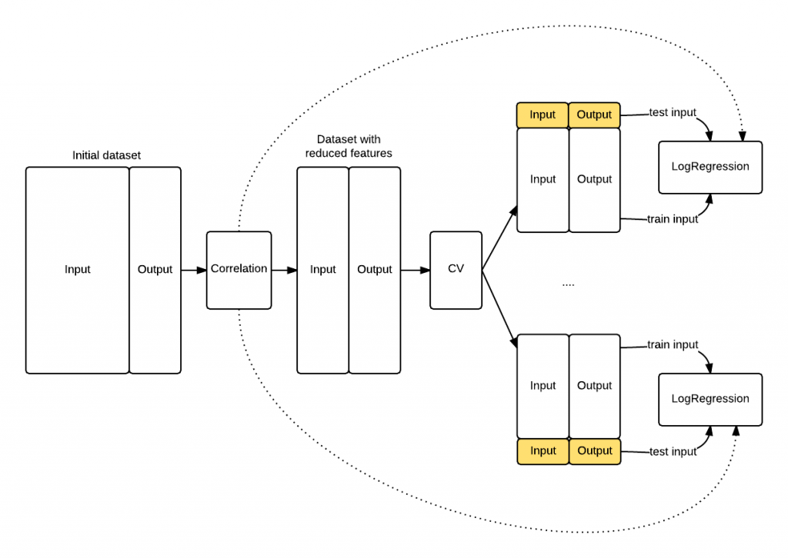
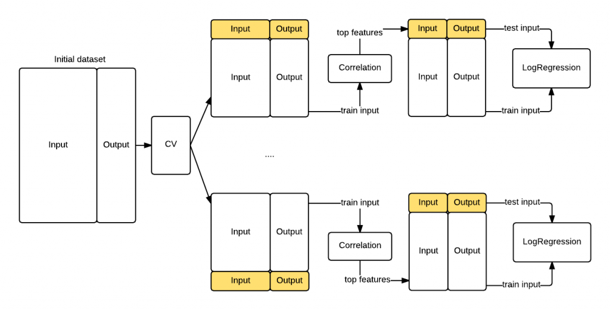

Cross validation is an essential tool in statistical learning \[note\]Lecture 1 on cross validation - Statistical Learning @ Stanford\[/note\] to estimate the accuracy of your algorithm. Despite its great power it also exposes some fundamental risk when done wrong which may terribly bias your accuracy estimate.

In this blog post I'll demonstrate - using the Python scikit-learn\[note\]Scikit-learn framework\[/note\] framework - how to avoid the biggest and most common pitfall of cross validation in your experiments.

<!--more-->

## Theory first

Cross validation involves randomly dividing the set of observations into `k` groups (or folds) of approximately equal size. The first fold is treated as a validation set, and the machine learning algorithm is trained on the remaining `k-1` folds. The mean squared error is then computed on the held-out fold. This procedure is repeated k times; each time, a different group of observations is treated as a validation set.

This process results in k estimates of the MSE quantity, namely $MSE\_1$, $MSE\_2$,...$MSE\_k$. The cross validation estimate for the MSE is then computed by simply averaging these values:

$$CV\_{(k)} = 1/k \\sum\_{i=1}^k MSE\_i$$

This value is an _estimate_, say $\\hat{MSE}$, of the real $MSE$ and our goal is to make this estimate as accurate as possible. $MSE$ is just one for the possible metrics you can estimate using cross validation but the results of this blog post are independent from the type of metric you use.

## Hands on

Let's now have a look at one of the most typical mistakes when using cross validation. When cross validation is done wrong the result is that $\\hat{MSE}$ does not reflect its real value $MSE$. In other words, you may think that you just found a perfect machine learning algorithm with incredibly low $MSE$, while in reality you simply wrongly applied CV.

I'll first show you - hands on - a wrong application of cross validation and then we will fix it together. The code is also available as an IPython notebook on github.

### Dataset generation

```
# Import pandas
import pandas as pd
from pandas import *

# Import scikit-learn
from sklearn.linear_model import LogisticRegression
from sklearn.cross_validation import *
from sklearn.metrics import *
import random
```

To make things simple let's first generate some random data and let's pretend that we want to build a machine learning algorithm to predict the outcome. I'll first generate a dataset of `100` entries. Each entry has `10.000` features. But, why so many? Well, to demonstrate our issue I need to generate some correlation between our inputs and output which is purely casual. You'll understand _the why_ later in this post.

```
np.random.seed(0)
features = np.random.randint(0,10,size=[100,10000])
target = np.random.randint(0,2,size=100)

df = DataFrame(features)
df['target'] = target
df.head()
```

### Feature selection

At this point we would like to know what are the features that are more useful to train our predictor. This is called _feature selection_. The simplest approach to do that is to find which of the `10.000` features in our input is mostly correlated the target. Using `pandas` this is very easy to do thanks to the `corr()` function. We run `corr()` on our dataframe, we order the correlation values, and we pick the first two features.

```
corr = df.corr()['target'][df.corr()['target'] < 1].abs()
corr.sort(ascending=False)
corr.head()

# 8487    0.428223
# 3555    0.398636
# 627     0.365970
# 3987    0.361673
# 1409    0.357135
# Name: target, dtype: float64

```

### Start the training

Great! Out of the `10.000` features we have been able to select two of them, i.e. feature number `8487` and `3555` that have a `0.42` and `0.39` correlation with the output. At this point let's just drop all the other columns and use these two features to train a simple `LogisticRegression`. We then use scikit-learn `cross_val_score` to compute $\\hat{MSE}$ which in this case is equal to `0.249`. Pretty good!

```
features = corr.index[[0,1]].values
training_input = df[features].values
training_output = df['target']
logreg = LogisticRegression()

# scikit learn return the negative value for MSE
# http://stackoverflow.com/questions/21443865/scikit-learn-cross-validation-negative-values-with-mean-squared-error
mse_estimate = -1 * cross_val_score(logreg, training_input, training_output, cv=10, scoring='mean_squared_error')

mse_estimate
# array([ 0.45454545, 0.2, 0.2, 0.1, 0.1,
#        0., 0.3, 0.4, 0.3, 0.44444444])

DataFrame(mse_estimate).mean()
# 0 0.249899
# dtype: float64
```

Note \[1\]: I am using $MSE$ here to evaluate the quality of the logistic regression, but you should probably consider using a Chi-squared test. The interpretation of the results that follows is equivalent.

Note \[2\]: By default scikit-learn use Stratified KFold\[note\]Stratified KFold Documentation\[/note\] where the folds are made by preserving the percentage of samples for each class.

### Knowledge leaking

According to the previous estimate we built a system that can predict a random noise target from a random noise input with a $MSE$ of just `0.249`. The result is, as you can expect, wrong. But why?

The reason is rather counterintuitive and this is why this mistake is so common\[note\]Lecture 2 on cross validation - Statistical Learning @ Stanford\[/note\]. When we applied the feature selection we used information from both the training set and the test sets used for the cross validation, i.e. the correlation values. As a consequence our `LogisticRegression` knew information in the test sets that were supposed to be hidden to it. In fact, when you are computing $MSE\_i$ in the i-th iteration of the cross validation you should be using only the information on the training fold, and nothing should come from the test fold. In our case the model did indeed have information from the test fold, i.e. the top correlated features. I think the term **knowledge leaking** express this concept fairly well.

The schema that follows shows you how the knowledge leaked into the `LogisticRegression` because the feature selection has been applied _before_ the cross validation procedure started. The model knows something about the data highlighted in yellow that it shoulnd't know, its top correlated features.

\[caption id="attachment\_922" align="aligncenter" width="660"\] Figure 1. The exposed knowledge leaking. The LogisticRegression knows the top correlated features of the entire dataset (hence including test folds) because of the initial correlation operation, whilst it should be exposed only to the training fold information.\[/caption\]

### Proof that our model is biased

To check that we were actually wrong let's do the following: \* Take out a portion of the data set (take\_out\_set). \* Train the LogisticRegression on the remaining data using the same feature selection we did before. \* After the training is done check the $MSE$ on the take\_out\_set.

Is the $MSE$ on the take\_out\_set similar to the $\\hat{MSE}$ we estimated with the CV? The answer is no, and we got a much more reasonable $MSE$ of `0.53` that is much higher than the $\\hat{MSE}$ of `0.249`.

```
take_out_set = df.ix[random.sample(df.index, 30)]
training_set = df[~(df.isin(take_out_set)).all(axis=1)]

corr = training_set.corr()['target'][df.corr()['target'] < 1].abs()
corr.sort(ascending=False)
features = corr.index[[0,1]].values

training_input = training_set[features].values
training_output = training_set['target']

logreg = LogisticRegression()
logreg.fit(training_input, training_output)

# LogisticRegression(C=1.0, class_weight=None, dual=False, fit_intercept=True,
# intercept_scaling=1, max_iter=100, multi_class='ovr',
# penalty='l2', random_state=None, solver='liblinear', tol=0.0001,
# verbose=0)

y_take_out = logreg.predict(take_out_set[features])
mean_squared_error(take_out_set.target, y_take_out)
# 0.53333333333333333
```

## Cross validation done right

In the previous section we have seen that if you inject test knowledge in your model your cross validation procedure will be biased. To avoid this let's compute the features correlation during each cross validation batch. The difference is that now the features correlation will use only the information in the training fold instead of the entire dataset. That's the key insight causing the bias we saw previously. The following graph shows you the revisited procedure. This time we got a realistic $\\hat{MSE}$ of `0.44` that confirms the data is randomly distributed.

\[caption id="attachment\_928" align="aligncenter" width="660"\] Figure 2. Revisited cross validation workflow with the correlation step performed for each of the K train/test folds.\[/caption\]

```
kf = StratifiedKFold(df['target'], n_folds=10)
mse = []
fold_count = 0
for train, test in kf:
  print("Processing fold %s" % fold_count)
  train_fold = df.ix[train]
  test_fold = df.ix[test]

  # find best features
  corr = train_fold.corr()['target'][train_fold.corr()['target'] < 1].abs()
  corr.sort(ascending=False)
  features = corr.index[[0,1]].values

  # Get training examples
  train_fold_input = train_fold[features].values
  train_fold_output = train_fold['target']

  # Fit logistic regression
  logreg = LogisticRegression()
  logreg.fit(train_fold_input, train_fold_output)

  # Check MSE on test set
  pred = logreg.predict(test_fold[features])
  mse.append(mean_squared_error(test_fold.target, pred))

  # Done with the fold
  fold_count += 1

print(DataFrame(mse).mean())

# Processing fold 0
# Processing fold 1
# Processing fold 2
# Processing fold 3
# Processing fold 4
# Processing fold 5
# Processing fold 6
# Processing fold 7
# Processing fold 8
# Processing fold 9

DataFrame(mse).mean()
# 0 0.441212
# dtype: float64
```

## Conclusion

We have seen how doing features selection at the wrong step can terribly bias the $MSE$ estimate of your machine learning algorithm. We have also seen how to correctly apply cross validation by simply moving one step down the features selection such that the knowledge from the test data does not leak in our learning procedure.

If you want to make sure you don't leak info across the train and test set scikit learn gives you additional extra tools like the feature selection pipeline\[note\]Scikit-learn feature selection pipeline\[/note\] and the classes inside the feature selection module\[note\]Scikit-learn feature selection modules\[/note\].

Finally, if you want know more about cross validation and its tradeoffs both R. Kohavi\[note\]R. Kohavi. A study of cross-validation and bootstrap for accuracy estimation and model selection\[/note\] and Y. Bengio with Y. Grandvalet\[note\]Y. Bengio and Y. Grandvalet. No unbiased estimator of the variance of k-fold cross-validation\[/note\] wrote on this topic.

If you liked this post you should consider following me on twitter. Let me know your comments!

### References
