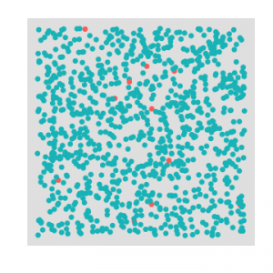
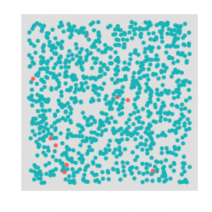
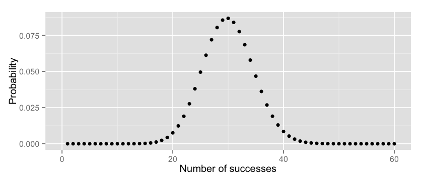
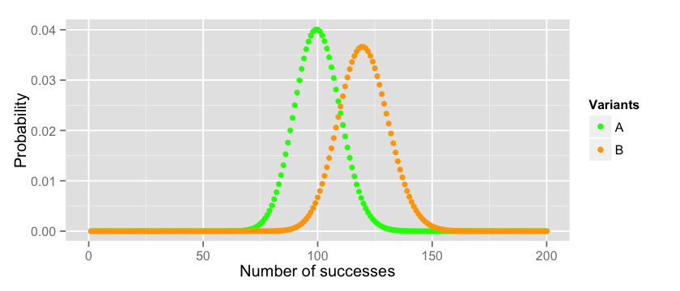
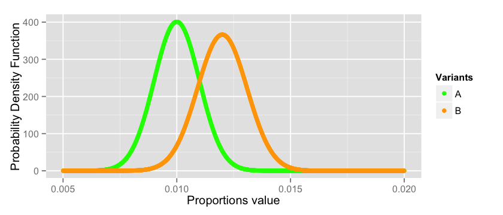
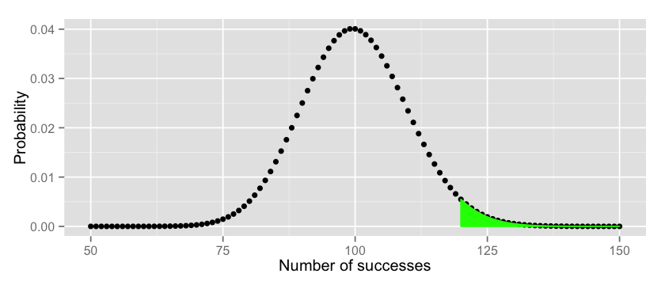
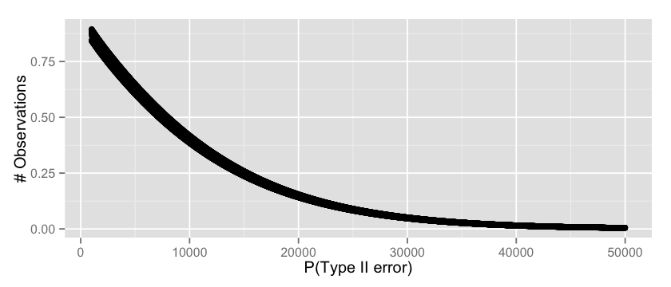
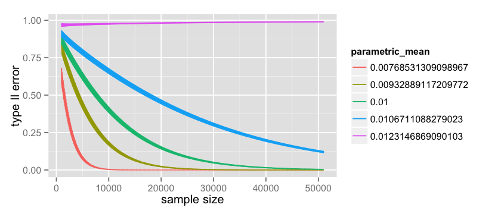
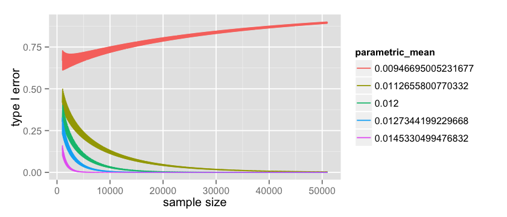

If you work in a diligent web development business you probably know what an A/B test is. However, its fascinating statistical theory is usually left behind. Understanding the basics can help you avoid common pitfalls, better design your experiments, and ultimately do a better job in improving the effectiveness of your website.

Please hold tight, and enjoy a pleasant statistical journey with the help of R and some maths. You will not be disappointed.

<!--more-->

This blog post is also published on my company blog which inspired those studies.

## Introduction

An A/B test is a randomized, controlled experiment in which the _performance_ of two product variants are compared. Those variants are usually called A and B \[note\]Wikipedia page on A/B testing\[/note\]. From a business perspective we want to know if the _performance_ of a certain variant outperforms the other.

As an example let's take a typical checkout page where we want to assess if a green checkout button is more effective than an orange one.

\[caption id="attachment\_1006" align="aligncenter" width="400"\] Figure 1: Experiment example\[/caption\]

After 1 week we may collect the following numbers:

|  | Converted | Total |
| --- | :-: | --: |
| Variant A | 100 | 10000 |
| Variant B | 120 | 10000 |

If at this point you are willing to conclude that the B variant outperforms A be aware you are taking a very naïve approach. Results can vary on a weekly basis because of the intrinsic randomness of the experiment. Put simply, you may be plain wrong. A more thorough approach would be to estimate the likelihood of B being better than A given the number we measured, and statistics is the best tool around for this kind of job.

## Statistical modeling

Statisticians love jars and, guess what, our problem can be modeled as an extraction from two different jars. Both jars have a certain ratio of red and green balls. Red balls are customers who end up paying while green balls are customers who leave.

Does the jar belonging to variant B have a greater proportion of red balls compared to the other one? We can estimate this ratio by doing an extraction with replacement \[note\]_Extraction with replacement_\[/note\] from the jar. We extract a finite number of balls from each jar and we measure the proportions. In this type of experiment each time we pick a ball we also put it back to the jar to keep the proportions intact.

\[caption id="attachment\_1011" align="alignnone" width="300"\] Figure 2.a: Variant A population\[/caption\]

\[caption id="attachment\_1011" align="alignnone" width="300"\] Figure 2.b: Variant B population\[/caption\]

Now the good news is that the Binomial distribution \[note\]Binomial distribution\[/note\] models exactly this type of experiment. It will tell you the expected number of successes in a sequence of $n$ independent yes/no experiments, each of which yields success with probability $p$.

In other words, each time we extract $n$ balls from our jar we are conducting an experiment, and a _yes_ corresponds to a red ball while a _no_ corresponds to a green ball. The binomial distribution \[note\]Probability mass function\[/note\] computes the probability of picking exactly $k$ red balls after $n$ extractions as follows:

(a) $Pr(X = k) = \\frac{n!}{k!(n-k)!} p^k (1-p)^{n-k}$

which can be checked using the `dbinom()` function in R. Assuming we have a jar with 30% of red balls, what is the probability that we extract _exactly_ 10 red balls out of a 100? This is equivalent to $Pr(X = 10)$ which is:

```
dbinom(10, 100, 0.3)
# => 1.17041796785404e-06
```

Very small. Fair enough, the jar has definitely a bigger proportions of red and I was the unlucky guy here. Now, let's plot these values for x (number of successes) ranging between 0 and 100:

```
x =  1:100
y = dbinom(x, 100, 0.3)

options(repr.plot.width=7, repr.plot.height=3)
qplot(x, y, xlab="Number of successes", ylab="Probability") + xlim(0, 60)
```



Makes sense, doesn't it? The chances of having exactly k successes cumulates around the value of 30, which is the true proportion of red/green balls in our jar.

## Naïve experiment assessment

Now that we know how statisticians model our problem let's go back to our conversions table.

One way of assessing if B is better than A is to plot their expected distributions. _Assuming that_ A follows a Binomial distribution with $p=0.01$ (we had 100 conversions over 10000 trials) and that B follows a Binomial distribution with $p=0.012$ (we had 120 conversions over 10000 trials) this is how they relate to each other:

```
x_a =  1:10000
y_a = dbinom(x_a, 10000, 0.01)

x_b =  1:10000
y_b = dbinom(x_b, 10000, 0.012)

data = data.frame(x_a=x_a, y_a=y_a, x_b=x_b, y_b=y_b)

options(repr.plot.width=7, repr.plot.height=3)
cols = c("A"="green","B"="orange")
ggplot(data = data)+
    labs(x="Number of successes", y="Probability") + xlim(0, 200) +
    geom_point(aes(x=x_a, y=y_a, colour="A")) +
    geom_point(aes(x=x_b, y=y_b, colour="B")) +
    scale_colour_manual(name="Variants", values=cols)
```



So _if the true mean_ of the two distribution is $p\_a = 0.01$ and $p\_b = 0.012$ respectively we can conclude that B is better than A. If we repeat the experiment several times (always with 10000 participants) for A we will get _most of the time_ values between $70$ and $129$ while for B we will get values between $87$ and $152$. You can check these boundaries on the plot, or you can compute them manually with the _3 times standard deviation_ rule of thumb \[note\]3 times standard deviation rule of thumb\[/note\].

```
n=10000; p=0.01; q=1-p; mean=100
paste(mean - 3 * sqrt(n*p*q), "," ,mean + 3 * sqrt(n*p*q))

n=10000; p=0.012; q=1-p; mean=120
paste(mean - 3 * sqrt(n*p*q), ",", mean + 3 * sqrt(n*p*q))
```

But hold on one minute. How do we know that $p\_a = 0.01$ and $p\_b = 0.012$ are indeed the _true means_ of our distributions? In the end we simply did one extraction from our jars. If these numbers are wrong our distributions will look different and the previous analysis will be flawed. Can we do better?

## More rigorous experiment assessment

In order to estimate what is the true mean of our variants statisticians rely on the Central Limit Theorem (CLT) \[note\]Central Limit Theorem\[/note\] which states that the distribution of the mean of a large number of independent, identically distributed variables will be approximately normal, regardless of the underlying distribution.

In our case we are trying to estimate the distribution of the mean of the proportions $p\_a$ and $p\_b$ for our variants. Suppose you run your A/B test experiment $N=100$ times and that each time you collect $n=10000$ samples you will end up having for variant A:

$p\_a^1, p\_a^2 ... p\_a^N$

and the CLT tells us that these are normally distributed with parameters:

$\\mu\_p = p$, $\\sigma\_p = \\frac{\\sigma}{sqrt(n)} \* \\frac{N-n}{N-1} \\approx \\sqrt{\\frac{p \* (1-p)}{n}}$

where $\\sigma = \\sqrt{p \* (1-p)}$ is the standard deviation of the binomial distribution. I know, this is hard to believe and proving these numbers goes definitely beyond the scope of this blog post so you will find some maths-heavy material in the footnotes \[note\]Sampling Distributions\[/note\] \[note\]The Central Limit Theorem around 1935\[/note\].

Back to our question, what is the true mean of $p\_a$ and $p\_b$? Well, we don't know really, but they are distributed normally like this:

```
x_a = seq(from=0.005, to=0.02, by=0.00001)
y_a = dnorm(x_a, mean = 0.01, sd = sqrt((0.01 * 0.99)/10000))

x_b = seq(from=0.005, to=0.02, by=0.00001)
y_b = dnorm(x_b, mean = 0.012, sd = sqrt((0.012 * 0.988)/10000))

data = data.frame(x_a=x_a, y_a=y_a, x_b=x_b, y_b=y_b)
options(repr.plot.width=7, repr.plot.height=3)
cols = c("A"="green","B"="orange")
ggplot(data = data)+
    labs(x="Proportions value", y="Probability Density Function") +
    geom_point(aes(x=x_a, y=y_a, colour="A")) +
    geom_point(aes(x=x_b, y=y_b, colour="B")) +
    scale_colour_manual(name="Variants", values=cols)
```



As you can see we are dealing with a risky business here. There is a good chance that the estimation of the _true values_ of $p\_a$ and $p\_b$ are not correct since they can span anywhere between all the values plotted above. For a good number of them $p\_a$ may actually outperform $p\_b$ violating the conclusion we did in the previous section. There is no magic bullet that will solve this problem, this is the intrinsic nature of the probabilistic world in which we live. However, we can do our best to quantify the risk and take a conscious decision.

## Quantitative evaluation

In the previous section we have seen that _it is likely_ that Variant B is better than Variant A, but how can we quantify this statement? There are different ways in which we can look at this problem, but the ones that statisticians use is _Hypothesis testing._

In a series of papers in the early 20th century, J. Neyman and E. S. Pearson developed a decision-theoretic approach to hypothesis-testing \[note\]Neyman and Pearson, Biometrika, 1928\[/note\]. The theory was later extended and generalised by Wald \[note\]Wald, The Annals of Mathematical Statistics, 1939\[/note\]. For a full account of the theory, see the book of Lehmann and Romano \[note\]Lehmann and Romano, Springer Texts in Statistics, 2005\[/note\].

In this framework we state a hypothesis (also called _null-hypothesis_) and by looking at the number we will try to reject it. In our example we hypothesize that the true conversion of our visitors is $p\_a$ and that the proportion $p\_b$ we collected in the B variant is simply due to chance. In other words we assume that our real world visitors behave like in variant A and we quantify the probability of seeing variant B's proportions under this hypothesis.

So, what is the probability of having $120$ or more conversions if the true mean of the binomial distribution is $p\_a = 0.01$? We simply have to sum the probability of all possible events:

$$P(X\_a >= 120) = P(X\_a=120) +P(X\_a=121) + ... + P(X\_a = 10000)$$

To actually compute the number you can use the probability mass function in Formula (a) or you can use R:

```
binom.test(120, 10000, p = 0.01, alternative = "greater")
```

which gives us the following:

```
    Exact binomial test

data:  120 and 10000
number of successes = 120, number of trials = 10000, p-value = 0.0276
alternative hypothesis: true probability of success is greater than 0.01
95 percent confidence interval:
 0.01026523 1.00000000
sample estimates:
probability of success 
                 0.012
```

I deliberately specified `alternative = "greater"` in the function call to compute the chance of getting more than 120. But there are other ways \[note\]One-tailed vs two-tailed tests\[/note\] to approach the problem. The value we are looking for is the p-value \[note\]p-value on wikipedia\[/note\] `0.0276` which is exactly the probability of getting more than 120 successes, i.e. $P(X\_a >= 120)$. Visually it corresponds to the area under the right end tail of the distribution of A:

```
x_a =  1:10000
y_a = dbinom(x_a, 10000, 0.01)

data = data.frame(x_a=x_a, area=append(rep(0, 119), seq(from=120, to=10000, by=1)), y_a=y_a)

options(repr.plot.width=7, repr.plot.height=3)
ggplot(data = data)+
    labs(x="Number of successes", y="Probability") + xlim(50, 150) +
    geom_point(aes(x=x_a, y=y_a)) + geom_area(aes(x=area, y=y_a), colour="green", fill="green")
```



We are now ready to quantify to what degree our _null-hypothesis_ is true or false according to the numbers we collected in our experiment.

## Type I and Type II errors

It is well known that statisticians do not have the same talent in the art of giving names as computer scientists do.  This is well proved by the definition of _Type I_ and _Type II_ errors which are equivalent to the Machine learning definitions of _False positive_ and _False negative_.

A _Type I_ error is the probability of rejecting the null-hypothesis when the null-hypothesis is true. In our example this happens when we conclude there is an effect in our AB test variant, while in reality there is none.

A _Type II_ error is the probability of failing to reject the null-hypothesis when the null-hypothesis is false. In our example this happens when we conclude the AB test variant has no effect, while in reality it actually did.

In the previous section we quantified the probability of _Type_ _I_ error, which is equivalent to the p-value returned by the `binom.test` function. To quantify the _Type II_ error we need to know for what _$pvalue = \\alpha$_ we are willing to reject the _null-hypothesis._ It is common practice to use $\\alpha = 0.05$ so I'll just go with that.

Now, what is the critical number of conversions such that we reject the _null-hypothesis_ at $\\alpha = 0.05$? This is called the percentile \[note\]Percentile on Wikipedia\[/note\] and it is simply the $x\_{\\alpha}$ such that:

$P(X <= x\_{\\alpha}) = 1 - \\alpha$

which can also be computed easily in R with the following:

```
alpha = 0.05
qbinom(1 - alpha, 10000, 0.01)
# => 117
```

Now we know that starting from $117 + 1$ observations we will reject the null-hypothesis.

To compute the _Type II_ error we need to assume that the null-hypothesis is false ($p\_b = 0.012$) and quantify how likely it is to measure a value of $117$ or less since this is exactly what will lead us to a mistake!

$P(X\_b <= 117) = P(X\_b = 0) + P(X\_b = 1) ... + P(X\_b = 117)$

which is equivalent to:

```
pbinom(117, 10000, 0.012)
# => 0.414733285324603
```

which means that we have a ~= 40% chance to conclude our experiment did not have any effect, while in reality there was some.

That's seems harsh to me. What can we do? Apply the first law of the modern age of statistics which is, _get more data._ Assuming we can double our data and get $20.000$ visitors instead of $10000$ and that we measure the same proportions, our _Type II_ error will go down drammatically:

```
qbinom(0.95, 20000, 0.01) # critical value at which we reject the null-hypothesis
# => 223

pbinom(223, 20000, 0.012) # type II error
# => 0.141565461885161
```

now we have ~= 14% chance of concluding our experiment did not have any effect. We can even go one step further and see for every possible observation count what's the expected _Type II error_ by simply brute forcing the computation as follows:

```
v = c(); n = 1000:50000
for(i in n) {
    critical = qbinom(0.95, i, 0.01)
    t2_error = pbinom(critical, i, 0.012)
    v = append(v, t2_error)
}

options(repr.plot.width=7, repr.plot.height=3)
qplot(n, v, xlab="P(type II error)", ylab="# Observations")
```



which seems a fair result, starting from $30.000$ visitors we can safely assume that our probability or _Type II_ error will be low.

The analysis as I just presented it is flawed by a fundamental assumption. To estimate the _Type I_ error we assumed that $p\_b$ is exactly $0.012$ while to estimate the _Type II_ error we assumed that $p\_a$ is exactly $0.01$. We know from the CLT that this is not exactly true and the distributions of those values span across a certain range (see here). So let's see what happens if I take several points across these distributions, for example the 1%, 25%, 50%, 75%, 99% percentiles and check what happens to our hypothesis testing errors.

For _Type II_ errors I first collect the possible values of $p\_a$ for my parametric analysis:

```
mean = 0.01
sigma = sqrt((mean * 0.99)/10000)
p_a_values = c(
    qnorm(0.01, mean = mean, sd = sigma),
    qnorm(0.25, mean = mean, sd = sigma),
    qnorm(0.50, mean = mean, sd = sigma),
    qnorm(0.75, mean = mean, sd = sigma), 
    qnorm(0.99, mean = mean, sd = sigma))
p_a_values
```

and then I estimate the error exactly like I did previously:

```
# parametric Type II
count = 50000; start = 1000
data = data.frame(x= numeric(0), error= numeric(0), parametric_mean = character(0))
p_a_values = factor(p_a_values)

for(p_a in p_a_values) {
    n = start:(start+count)
    x = rep(0, count); error = rep(0, count); parametric_mean = rep('0', count);
    for(i in n) {
        p_a_numeric = as.numeric(as.character(p_a))
        critical = qbinom(0.95, i, p_a_numeric)
        t2_error = pbinom(critical, i, 0.012)
        
        index = i - start + 1
        x[index] = i
        error[index] = t2_error
        parametric_mean[index] = p_a
    }
    data = rbind(data, data.frame(x = x, error = error, parametric_mean=parametric_mean))
}

options(repr.plot.width=7, repr.plot.height=3)
ggplot(data=data, aes(x=x, y=error, color=parametric_mean, group=parametric_mean)) +
    geom_line()
```

which produces the following:



where the green line is the same as the one plotted here. It is quite interesting to observe the pink line at $p\_a = 0.0123$. This is the worst case scenario for us since we picked a value that is greater than $p\_b = 0.012$ and because of that our _Type II_ error actually increases with the number of observations! However it is also worth mentioning that this value is very unlikely because the more data I collect the more the uncertainty around the values of $p\_a$ decrease. You may also notice that the lines in the graph are quite thick, and this is because discrete tests like the binomial one \[note\]Binomial test on Wikipedia\[/note\] have quite large oscillations \[note\]Binomial test error oscillations on CrossValidated\[/note\].

The same type of parametric analysis can be performed on the _Type I_ error. Previously we saw how to compute it with the `binom.test()` function, but we can do the computation manually as follows when $p\_a=0.01$ and $p\_b=0.012$:

```
pbinom(119, 10000, 0.01, lower.tail=FALSE)
```

where $119$ is the value starting from which we fail to reject the null-hypothesis. The parametric analysis is a generalisation of this code like we did for the _Type II_ error:

```
# parametric Type I
count = 50000
start = 1000
data = data.frame(x= numeric(0), error= numeric(0), parametric_mean = character(0))
p_b_values = factor(p_b_values)

for(p_b in p_b_values) {
    n = start:(start+count)
    x = rep(0, count); error = rep(0, count); parametric_mean = rep('0', count);
    for(i in n) {
        p_b_numeric = as.numeric(as.character(p_b))
        expected_b = i * p_b_numeric
        t1_error = pbinom(expected_b - 1, i, 0.01, lower.tail=FALSE)
        
        index = i - start + 1
        x[index] = i
        error[index] = t1_error
        parametric_mean[index] = p_b
    }
    data = rbind(data, data.frame(x = x, error = error, parametric_mean=parametric_mean))
}

options(repr.plot.width=7, repr.plot.height=3)
ggplot(data=data, aes(x=x, y=error, color=parametric_mean, group=parametric_mean)) +
    geom_line()
```

which plots the following:



as in the _Type II_ error we notice that for $p\_b = 0.009$ the _Type I_ error actually increase with the amount of data but this value become more and more unlikely as the data grows.

It also very interesting to notice how the value of the two type of errors goes down at a completely different rate. Overall, with this design, we are more likely to stick with the "_button colour makes no difference_" conclusion. When the reality is that button colour makes no difference, the tests will stick to reality most of the times (_Type I error goes down quickly_). When the reality is that button colour does make a difference, the test does take the risk of saying there is actually no difference between the two (_Type II error goes down slowly_).

## Estimate the sample size

Before wrapping up let's make a step back and position ourself back in time before we started the experiment. How we can estimate for how long we should run our experiment in order to be confident that our results are statistically significant? To answer this question you simply need to use the same tools we just saw, from a different perspective.

First, you need to make an estimate around your current baseline conversion. If you use google analytics it should be straightforward to know what is the conversion of your checkout page with the green button.

Second, you need to make a guess on what type of _effect size_ you are willing to detect (_minimum detectable effect size_). In our example we would have chosen an effect size of 20%. In various disciplines effect sizes have been standardised to make different experiments comparable. Most famous effect size measure is _Cohen's d_ \[note\]Thresholds for interpreting effect sizes\[/note\] \[note\]Using Effect Size—or Why the P Value Is Not Enough\[/note\].

Third, you need to assert what risk you are willing to take on the _Type I error_, or equivalently, what $\\alpha$ level you are willing to choose for your _p-value_. This is the value you will refer to at the end of the experiment to make your conclusion.

Finally, you need to assert what risk you are willing to take on the _Type II error_, or equivalently, how likely you are willing to say your orange button did not perfomed better when in reality there was an effect (i.e. orange button is better). This is equivalent to the _power_, where you assert how likely you are going to be correct when you conclude that the orange button is better, when it is actually real.

Mathematically speaking computing the required sample size seems to be a difficult problem in general and I would like to point you to the footnotes for a deeper discussion \[note\]Sample size determination for hypothesis testing of means\[/note\] \[note\]Statistical Methods for Rates and Proportions, Third Edition\[/note\] \[note\]Sample Size Calculation For Comparing Proportions, Wiley Encyclopedia of Clinical Trials\[/note\]. Here I will show the approach taken from the Engineering statistics handbook \[note\]Engineering statistics handbook - sample sizes required\[/note\].

First, we are look at the statistics:

$\\delta = |p\_a - p\_b|$

and we would like to compute the sample size _n_ such that:

(1) P(reject H0 | H0 is true) = $\\alpha$ (2) P(reject H0 | H0 is false) = _power_ = $1 - \\beta$

Now, you have to use some faith and intuition. What is the smallest value of $\\delta$, say $\\delta\_{min}$, that we care about? Our minimum detectable effect size! You can imagine $\\delta\_{min}$ is a function of both (1) and (2). The smallest value in (1) for which we start rejecting is:

$z\_{1-\\alpha} \* \\sqrt{\\frac{p\_a \* (1-p\_a)}{N}}$

while the smallest value in (2) for which we start rejecting is:

$z\_{1-\\beta} \* \\sqrt{\\frac{p\_b \* (1-p\_b)}{N}}$

where $power = 1 - \\beta$ putting it all together we have:

$\\delta\_{min} = z\_{1-\\alpha} \* \\sqrt{\\frac{p\_a \* (1-p\_a)}{N}} +z\_{1-\\beta} \* \\sqrt{\\frac{p\_b \* (1-p\_b)}{N}}$

Take the N out of this equation and you get:

$N = (\\frac{ z\_{1-\\alpha} \* \\sqrt{p\_a \* (1-p\_a)} + z\_{1-\\beta} \* \\sqrt{p\_b \* (1-p\_b)}}{\\delta\_{min}})^2$

So, using our example we state that: (i) our baseline conversion for the green button is _1%_ or $p\_a = 0.01$; (ii) our estimate of effect size is _20%_ which leads to the orange button converting at _1.2%_ or $p\_b = 0.012$; (iii) we accept a _Type I error_ probability of _5%_ or $\\alpha = 0.05$; (iv) we want a _Power_ of _80%_ to make sure we detect the effect when it is there.  This is translated in R as follows:

```
p_a = 0.01
p_b = 0.012
alpha = 0.05
beta = 0.2

delta = abs(p_a - p_b)

t_alpha = qnorm(1 - alpha)
t_beta = qnorm(1 - beta)

sd1 = sqrt(p_a * (1-p_a))
sd2 = sqrt(p_b * (1-p_b))

n = ((t_alpha * sd1 + t_beta * sd2) / abs(p_a - p_b))^2

# => ~= 16294
```

which seems to be consistent with the simulations we did previously. On the other hand it is 30% lower than the one reported by a fairly famous online tool \[note\]Evan Awesome AB Tools\[/note\] \[note\]Evan Miller source code for sample size\[/note\]. If you know why please let me know in the comments.

## Wrapping up

In this blog post we took a simple conversion table and we did a step by step statistical analysis of our results. Our experiment is designed like an extraction with replacement from a jar which is modelled with a binomial distribution.

We concluded that given the observed data the checkout page with the orange button is 20% more likely (`(0.012 - 0.01) / 0.01`) to convert than the one with the green button. If the green button is equivalent to the orange button (no effect), we came to the wrong conclusion with a probability of `2.76%` (_P(type I error)_, also called _p-value_). If the orange button is better than the green button, we came to the right conclusion with a probability of `60%` (_1 - P(type II error)_, also called the _power_). In this same scenario (orange button is better) if we double the number of visitors in our experiment our probability of being correct (power) will go up to `86%`. Finally, we reviewed how to estimate the required sample size for our experiment in advance with a handy formula.

It is worth mentioning that in practice you rarely use a binomial test but I belive the simplicity of the distribution makes it adequate for this type of presentation. A better resource on choosing the right test can be found in the references \[note\]An Overview: choosing the correct statistical test\[/note\].

If you enjoyed this blog post you can also follow me on twitter. Let me know your comments!

## References
