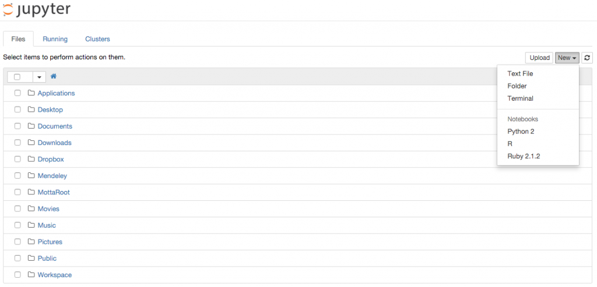
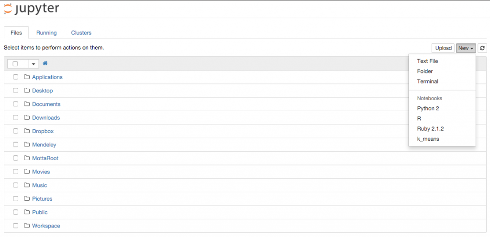

Everyone loves isolation. Makes our life easier and our systems much more robust. Isolating Jupyter notebooks makes no exception. Maybe you want to try some cutting edge scientific library, or more simply your latest project dependencies are not compatible with your current system setup.

Whatever is your situation, follow me in this simple tutorial on how to create an isolated python notebook kernel.

<!--more-->

## Introduction

If you are a day-to-day Jupyter user you probably know what kernels are. If you are not, a kernel is simply a language virtual machine running behind the scenes and connected to the Jupyter browser interface. Each time you create a new notebook you have to select the kernel from the top right drop down menu of the interface as shown here:



The goal of this blog post is to add a new kernel on a python environment that is different from the one that I have installed already. This is especially useful if you are trying out some project and you want the dependencies of the new project to be installed in a separate python local setup. We can do that in 3 "easy" steps :)

## Step 1: Install pyenv, virtualenv, and pyenv-virtualenv

First we need a way to create different python environments. Each environment will have its own version and isolated package set. On paper it is far from easy, but thanks to Pyenv \[note\]Pyenv homepage\[/note\] and virtualenv\[note\]Virtualenv homepage\[/note\] the job turns out to be pretty simple.

To install it on MacOSx all you need to do is:

```
$ brew update
$ brew install pyenv
```

and add to your .bashrc the following:

```
eval "$(pyenv init -)"
```

Installing virtualenv is also fairly easy:

```
$: pip install virtualenv
$: pip install virtualenvwrapper
```

Finally, install pyenv-virtualenv \[note\]Pyenv-virtualenv homepage\[/note\]:

```
$: brew install pyenv
$: brew install pyenv-virtualenv
```

and add to your .bashrc the following:

```
eval "$(pyenv virtualenv-init -)"
```

## Step 2: Create an isolated python environment

Let's assume now that I want to test my latest project in a Jupyter notebook running a Python kernel with Python 2.7.3. Since I have several projects running on this Python version I also want to have a dedicated Python 2.7.3 environment for my latest project.

First let's see all the python versions available to pyenv:

```
$ pyenv install --list
```

and let's install the one we wants:

```
$ pyenv install 2.7.3
```

Now it is time to create a dedicated environment for our project. Suppose I am working on a bleeding age implementation of `k_means` clustering algorithm (...). This is how I create my working environment:

```
$: pyenv virtualenv 2.7.3 k_means
```

and I now see the following:

```
:~$ pyenv versions
system
* 2.7.3 (set by /Users/motta/.pyenv/version)
3.5.0
k_means
```

Let's switch our python environment to the one we created for our new project

```
:~$ pyenv virtualenvs
k_means (created from /Users/motta/.pyenv/versions/2.7.11rc1)
:~$ pyenv activate k_means
:~$ pyenv virtualenvs
* k_means (created from /Users/motta/.pyenv/versions/2.7.11rc1)
:~$
```

and let's install the basic scientific packages we need:

```
:~$ pip install numpy
:~$ pip install pandas
```

these packages will be local to our k\_means python installation and will not affect our system python (for example). To access this environment from Jupyter you need the python kernel too, so let's install it:

```
:~$ pip install ipykernel
```

Finally, let's deactivate our environment.

```
:~$ pyenv deactivate
```

## Step 3: Create your isolated Jupyter python kernel

Now we have to connect our Jupyter to the isolated python enviroment we created in the previous two steps. I am assuming you have already jupyter installed in your system Python. If not, go ahead and install it here.

If you are in the right environment with jupyter installed you should see the following:

```
:~$ pip list | grep jupyter
jupyter-client (4.1.1)
jupyter-core (4.0.6)
```

In order to install a new Jupyter kernel you need to check where Jupyter is reading its configuration files. To do that simply run the following:

```
:~$ jupyter --paths
config:
    /Users/motta/.jupyter
    /Users/motta/.pyenv/versions/2.7.3/etc/jupyter
    /usr/local/etc/jupyter
    /etc/jupyter
data:
    /Users/motta/Library/Jupyter
    /Users/motta/.pyenv/versions/2.7.3/share/jupyter
    /usr/local/share/jupyter
    /usr/share/jupyter
runtime:
    /Users/motta/Library/Jupyter/runtime
```

Jupyter search for the kernels in the data directories in the order they are displayed. First, we need to find out where pyenv is storing our `k_means` environment, and we do it by executing the following:

```
:~$ pyenv activate k_means
:~$ pyenv which python
/Users/motta/.pyenv/versions/k_means/bin/python
:~$ pyenv deactivate
```

Now we are ready to create our kernel. First let's create the folder:

```
:~$ mkdir /Users/motta/Library/Jupyter/kernels/k_means
```

and let's add the following kernel.json file:

```
{
 "argv": [ "/Users/motta/.pyenv/versions/k_means/bin/python", "-m", "ipykernel",
          "-f", "{connection_file}"],
 "display_name": "k_means",
 "language": "python"
}
```

If you now run `jupyter notebook` you will have the new kernel available!



## Conclusions

In this blog post I presented how to create an isolated python kernel in your jupyter installation. This is not the only way to do it, so please share in the comments if you have better ways to achieve the same result!

If you enjoyed this blog post you can also follow me on twitter.

## References
