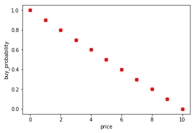
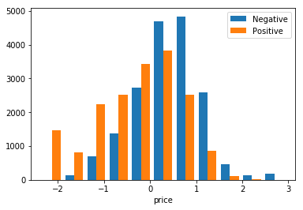
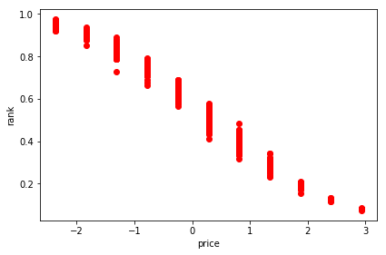
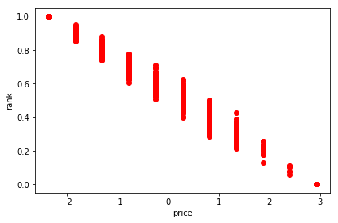
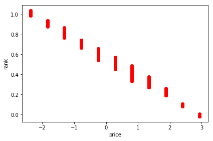

If you run an e-commerce website a classical problem is to rank your product offering in the search page in a way that maximises the probability of your items being sold. For example if you are selling shoes you would like the first pair of shoes in the search result page to be the one that is most likely to be bought.

Thanks to the widespread adoption of machine learning it is now easier than ever to build and deploy models that automatically learn what your users like and rank your product catalog accordingly. In this blog post I'll share how to build such models using a simple end-to-end example using the movielens open dataset.

<!--more-->

# Introduction

Imagine you have an e-commerce website and that you are designing the algorithm to rank your products in your search page. What will be the first item that you display? The one with the best reviews? The one with the lowest price? Or a combination of both? The problem gets complicated pretty quickly.

A simple solution is to use your intuition, collect the feedback from your customers or get the metrics from your website and handcraft the perfect formula that works for you. Not very scientific isn't it? A more complex approach involves building many ranking formulas and use A/B testing to select the one with the best performance.

Here we will instead use the data from our customers to automatically learn their _preference function_ such that the ranking of our search page is the one that maximise the likelihood of scoring a _conversion_ (i.e. the customer buys your item). Specifically we will learn how to rank movies from the movielens open dataset based on artificially generated user data. The full steps are available on Github in a Jupyter notebook format.

# Prepare the training data

To learn our ranking model we need some training data first. So let's generate some examples that mimics the behaviour of users on our website:

```
event_1: <customer_1, movie_1, fail>
event_2: <customer_1, movie_2, fail>
event_3: <customer_1, movie_3, success>
event_4: <customer_2, movie_2, fail>
event_5: <customer_2, movie_3, success>
...
```

The list can be interpreted as follows: `customer_1` saw `movie_1` and `movie_2` but decided to not buy. Then saw `movie_3` and decided to buy the movie. Similarly `customer_2` saw `movie_2` but decided to not buy. Then saw `movie_3` and decided to buy.

In a real-world setting scenario you can get these events from you analytics tool of choice, but for this blog post I will generate them artificially. To do that we will associate a `buy_probability` attribute to each movie and we will generate user events accordingly.

Our raw movies data looks like this:

```
movie_data.dtypes

title                      object
release_date       datetime64[ns]
unknown                     int64
Action                      int64
Adventure                   int64
Animation                   int64
Children's                  int64
Comedy                      int64
Crime                       int64
Documentary                 int64
Drama                       int64
Fantasy                     int64
Film-Noir                   int64
Horror                      int64
Musical                     int64
Mystery                     int64
Romance                     int64
Sci-Fi                      int64
Thriller                    int64
War                         int64
Western                     int64
ratings_average           float64
ratings_count               int64
price                     float64
dtype: object
```

and this is an example of a movie from the dataset:

```
'title',           'release_date',                   'unknown', 'Action', 'Adventure', 'Animation', "Children's", 'Comedy', 'Crime', 'Documentary', 'Drama', 'Fantasy', 'Film-Noir', 'Horror', 'Musical', 'Mystery', 'Romance', 'Sci-Fi', 'Thriller', 'War', 'Western', 'ratings_average', 'ratings_count', 'price'
'Toy Story (1995)', Timestamp('1995-01-01 00:00:00'), 0,        0,        0,           1,           1,            1,        0,       0,             0,       0,         0,           0,        0,         0,         0,         0,        0,          0,     0,         3.8783185840707963, 452,            7.0
```

Let's assume that our users will make their purchase decision only based on price and see if our machine learning model is able to learn such function. For this dataset the movies price will range between 0 and 10 (check github to see how the price has been assigned), so I decided to artificially define the buy probability as follows:

```
movie_data['buy_probability'] = 1 - movie_data['price'] * 0.1
```

With that buying probability function our perfect ranking should look like this:



No rocket science, the movie with the lowest price has the highest probability to be bought and hence should be ranked first. Now let's generate some user events based on this data. Each user will have a number of positive and negative events associated to them. A positive event is one where the user bought a movie. A negative event is one where the user saw the movie but decided to not buy.

```
class User:
    def __init__(self, id):
        self.id = id
        self.positive = []
        self.negative = []
        
    def add_positive(self, movie_id):
        self.positive.append(movie_id)
    
    def add_negative(self, movie_id):
        self.negative.append(movie_id)
    
    def get_positive(self):
        return self.positive
    
    def get_negative(self):
        return self.negative
```

Before moving ahead we want all the features to be normalised to help our learning algorithms. So let's get this out of the way. Also notice that we will remove the `buy_probability` attribute such that we don't use it for the learning phase (in machine learning terms that would be equivalent to cheating!).

```
def build_learning_data_from(movie_data):
    feature_columns = np.setdiff1d(movie_data.columns, np.array(['title', 'buy_probability']))
    learning_data = movie_data.loc[:, feature_columns]
    
    scaler = StandardScaler()
    learning_data.loc[:, ('price')] = scaler.fit_transform(learning_data[['price']])
    learning_data['ratings_average'] = scaler.fit_transform(learning_data[['ratings_average']])
    learning_data['ratings_count'] = scaler.fit_transform(learning_data[['ratings_count']])
    learning_data['release_date'] = learning_data['release_date'].apply(lambda x: x.year)
    learning_data['release_date'] = scaler.fit_transform(learning_data[['release_date']])
    
    return learning_data
```

finally using the `EventsGenerator` class shown below we can generate our user events. For simplicity let's assume we have `1000` users and that each user will open `20` movies. Real world data will obviously be different but the same principles applies.

```
np.random.seed(1)

class EventsGenerator:
    NUM_OF_OPENED_MOVIES_PER_USER = 20
    NUM_OF_USERS = 1000

    def __init__(self, learning_data, buy_probability):
        self.learning_data = learning_data
        self.buy_probability = buy_probability
        self.users = []
        for id in range(1, self.NUM_OF_USERS):
            self.users.append(User(id))
        
    def run(self):
        for user in self.users:
            opened_movies = np.random.choice(self.learning_data.index.values, self.NUM_OF_OPENED_MOVIES_PER_USER)
            self.__add_positives_and_negatives_to(user, opened_movies)

        return self.__build_events_data()

    def __add_positives_and_negatives_to(self, user, opened_movies):
        for movie_id in opened_movies:
            if np.random.binomial(1, self.buy_probability.loc[movie_id]): 
                user.add_positive(movie_id)
            else:
                user.add_negative(movie_id)
                
    def __build_events_data(self):
        events_data = []
        
        for user in self.users:
            for positive_id in user.get_positive():
                tmp = learning_data.loc[positive_id].to_dict()
                tmp['outcome'] = 1
                events_data += [tmp]
            
            for negative_id in user.get_negative():
                tmp = learning_data.loc[negative_id].to_dict()
                tmp['outcome'] = 0
                events_data += [tmp]
                
        return pd.DataFrame(events_data)
```

and this is how everything gets glued up together. The EventsGenerator takes the normalised movie data and uses the buy probability to generate user events.

```
learning_data = build_learning_data_from(movie_data)
events_data = EventsGenerator(learning_data, movie_data['buy_probability']).run()
```

And this is how one of these events look like:

```
'Action', 'Adventure', 'Animation', "Children's", 'Comedy', 'Crime', 'Documentary', 'Drama', 'Fantasy', 'Film-Noir', 'Horror', 'Musical', 'Mystery', 'Romance', 'Sci-Fi', 'Thriller', 'War', 'Western', 'outcome', 'price',    'ratings_average', 'ratings_count', 'release_date', 'unknown'
1,        1,           0,           0,            0,        0,       0,             0,       0,         0,           0,        0,         0,         0,         0,        0,          0,     1,         0,         0.28363692, 0.16953213,        -0.14286941,     0.39397757,     0
```

In this case we have a negative outcome (value 0) and the features have been normalised and centred in zero as a result of what we did in the function _build\_learning\_data\_from(movie\_data)._

If we plot the events we can see the distribution reflect the idea that people mostly buy cheap movies. Again price is centred in zero because of normalisation.



# Train our models

Now that we have our events let's see how good are our models at learning the (simple) `buy_probability` function. We will split our data into a training and testing set to measure the model performance (but make sure you know how cross validation works) and use this generic function to print the performance of different models.

```
def train_model(model, prediction_function, X_train, y_train, X_test, y_test):
    model.fit(X_train, y_train)
    
    y_train_pred = prediction_function(model, X_train)

    print('train precision: ' + str(precision_score(y_train, y_train_pred)))
    print('train recall: ' + str(recall_score(y_train, y_train_pred)))
    print('train accuracy: ' + str(accuracy_score(y_train, y_train_pred)))

    y_test_pred = prediction_function(model, X_test)

    print('test precision: ' + str(precision_score(y_test, y_test_pred)))
    print('test recall: ' + str(recall_score(y_test, y_test_pred)))
    print('test accuracy: ' + str(accuracy_score(y_test, y_test_pred)))
    
    return model
```

training the various models using scikit-learn is now just a matter of gluing things together. Let's start with Logistic Regression:

```
def get_predicted_outcome(model, data):
    return np.argmax(model.predict_proba(data), axis=1).astype(np.float32)

def get_predicted_rank(model, data):
    return model.predict_proba(data)[:, 1]

model = train_model(LogisticRegression(), get_predicted_outcome, X_train, y_train, X_test, y_test)

```

which gives us the following performance

```
train precision: 0.717381689518
train recall: 0.716596235113
train accuracy: 0.717328291166
test precision: 0.720525676086
test recall: 0.726374636238
test accuracy: 0.721590909091
```

We can do the same using a neural network and a decision tree. This is a neural network with 23 inputs (same as the number of movie features) and 46 neurons in the hidden layer (it is a common rule of thumb to double the hidden layer neurons).

```
from nolearn.lasagne import NeuralNet

def nn():
    return NeuralNet(
        layers=[  # three layers: one hidden layer
            ('input', layers.InputLayer),
            ('hidden', layers.DenseLayer),
            ('output', layers.DenseLayer),
            ],
        # layer parameters:
        input_shape=(None, 23),  # this code won't compile without SIZE being set
        hidden_num_units=46,  # number of units in hidden layer
        output_nonlinearity=None,  # output layer uses identity function
        output_num_units=1,  # this code won't compile without OUTPUTS being set

        # optimization method:
        update_learning_rate=0.01, 
        regression=True,  # If you're doing classification you want this off
        max_epochs=50,  # more epochs can be good, 
        verbose=1, # enabled so that you see meaningful output when the program runs
    )

def get_predicted_outcome(model, data):
    return np.rint(model.predict(data))

def get_predicted_rank(model, data):
    return model.predict(data)

```

and this is the performance we got

```
model = train_model(
 nn(), 
 get_predicted_outcome, 
 X_train.astype(np.float32), 
 y_train.astype(np.float32), 
 X_test.astype(np.float32), 
 y_test.astype(np.float32)
)

train precision: 0.698486217804
train recall: 0.687534749249
train accuracy: 0.65721971972
test precision: 0.667556742323
test recall: 0.679655641142
test accuracy: 0.636136136136
```

and finally with decision trees

```
def get_predicted_outcome(model, data):
    return np.argmax(model.predict_proba(data), axis=1).astype(np.float32)

def get_predicted_rank(model, data):
    return model.predict_proba(data)[:, 1]

```

which gives us the following performance

```
from sklearn import tree
model = train_model(tree.DecisionTreeClassifier(), get_predicted_outcome, X_train, y_train, X_test, y_test)

train precision: 0.680947848951
train recall: 0.711256135779
train accuracy: 0.653892069603
test precision: 0.668242778542
test recall: 0.704538759602
test accuracy: 0.644044702235

```

We can plot the various rankings next to each other to compare them. The shape of the ranking curve is very similar to the one we used to define the `buy_probability` which confirms that our algorithms learnt the _preference function_ correctly.

The shape isn't exactly the same describing the buy\_probability because the user events were generated probabilistically (binomial distribution with mean equal to the `buy_probability`) so the model can only approximate the underlying truth based on the generated events.

\[caption id="attachment\_1452" align="aligncenter" width="425"\] Logistic regression\[/caption\]

\[caption id="attachment\_1455" align="aligncenter" width="425"\] Decision Trees\[/caption\]

\[caption id="attachment\_1454" align="aligncenter" width="425"\] Neural Network\[/caption\]

# What's next

Once you got your ranking estimates you can simply save them in your database of choice and start serving your pages. With time the behaviour of your users may change like the products in your catalog so make sure you have some process to update your ranking numbers weekly if not daily. It could also be a good idea to A/B test your new model against a simple hand-crafted linear formula such that you can validate yourself if machine learning is indeed helping you gather more conversions.

If you prefer to wear the scientist hat you can also run the Jupyter notebook on Github with a different formula for `buy_probability` and see how well the models are able to pick up the underlying truth. I did tried a linear combination of non-linear functions of price and ratings and it worked equally well with similar accuracy levels.

```
price_component = np.sqrt(movie_data['price'] * 0.1)
ratings_component = np.sqrt(movie_data['ratings_average'] * 0.1 * 2)
movie_data['buy_probability'] = 1 - price_component * 0.2 - ratings_component * 0.8
```

Finally, a different approach to the one outlined here is to use pair of events in order to learn the ranking function. The idea is that you feed the learning algorithms with pair of events like these:

```
pair_event_1: <customer_1, movie_1, fail, movie_3, success>
pair_event_2: <customer_2, movie_2, fail, movie_3, success>
pair_event_3: <customer_3, movie_1, fail, movie_2, success>
...

```

With such example you could guess that a good ranking would be `movie_3, movie_2, movie_1` since the choices of the various customers enforce a total ordering for our set of movies. Despite predicting the pairwise outcomes has a similar accuracy to the examples shown above, come up with a global ordering for our set of movies turn out to be hard (NP complete hard, as shown in this paper from AT&T labs) and we will have to resort to a greedy algorithm for the ranking which affects the quality of the final outcome. A more in-depth description of this approach is available in this blog post from Julien Letessier.

# Conclusion

In this blog post I presented how to exploit user events data to teach a machine learning algorithm how to best rank your product catalog to maximise the likelihood of your items being bought. We saw how both logistic regression, neural networks and decision trees achieve similar performance and how to deploy your model to production.

Looking forward to hear your thoughts in the comments and if you enjoyed this blog you can also follow me on twitter.
