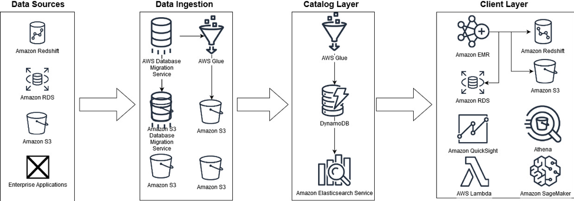
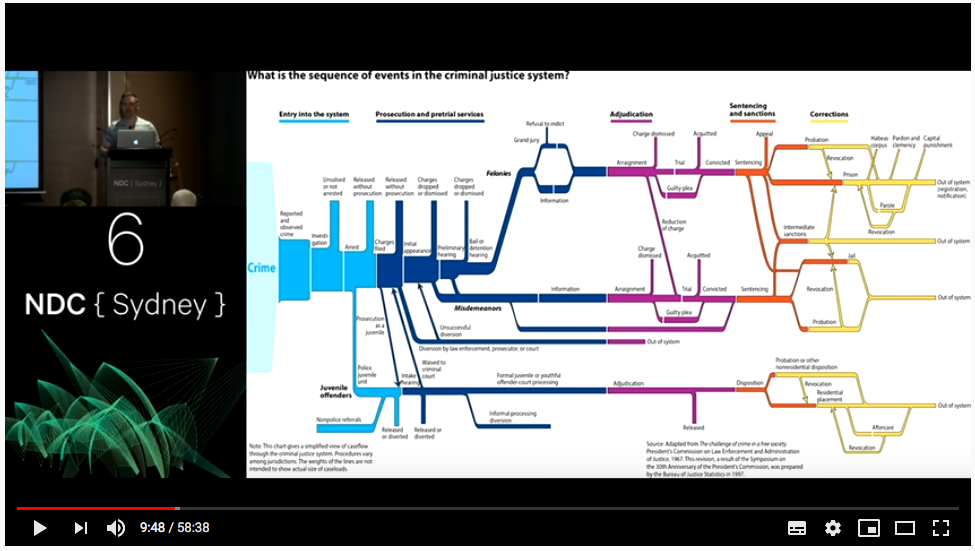
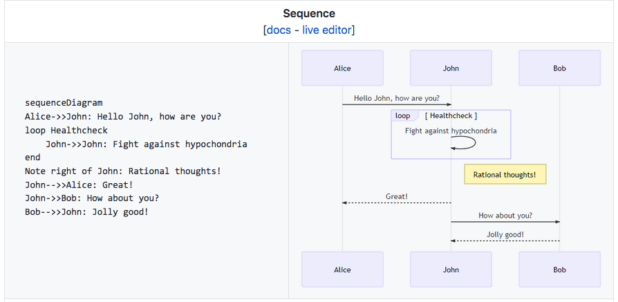

Welcome back to Not So Random Software. This week's links are dedicated to Software Architecture. Experts might define it as the art of taking decisions that are hard to change. Being a Software Architect is a role that you can either do full time — mindful of any ivory tower risk — or opportunistically — ideally as a team. Knowing how much architecture you need on your project is a critical skill to get it off the right start.

## A random article or paper

In this age, one of the hardest pieces of architecture to design is the one to process and store your data. With unprecedented growth in the amount and diversity of data, this is a real challenge.

This article by Werner Vogels (CTO at Amazon) featured in All Things Distributed blog described the latest tool you can use on the AWS stack to get the job done.



## A random video or podcast

A great deal of architecture work is about talking with stakeholders and understand what needs to be built. When you are dealing with _really big_ systems, this can get quite complicated. I stumbled upon this talk _Domain Driven Design: The Good Parts_ by Jimmy Bogard which highlights the challenges of building a criminal justice system for Texas counties. Here is a high-level diagram of all the processes, quite scary!



## A random book

Every time someone asks me for an architecture book I frankly have a hard time recommending one. I think the discipline is too broad to be covered by just one book. However, if you do architecture work, it is very likely that you will have to draw diagrams to communicate your design. I find Applying UML and Patterns: An Introduction to Object-Oriented Analysis and Design and Iterative Development to be a very good resource for that. It is not an easy book, but I find Chapters 17 and 18 on GRAP (Design Objects with Responsibilities) to be particularly good to explore OOP design tradeoffs.

## A random tool

Mermaid is an actively developed tool to generate UML diagrams from a textual description. The last time I tried was a bit too early, but I am quite curious to try out again this year!



## A random line of code

Did you know that you can run Machine Learning models in Ruby generated by other tools using the PMML exchange format? Well, now you do! Big thank you to Asaf Schers, the author of scoruby.

```
decision_tree = Scoruby.load_model 'decision_tree.pmml'
features = { f1 : v1, ... } 
decision_tree.decide(features)

=> #<Decision:0x007fc232384180 @score="0", @score_distribution={"0"=>"0.999615579933873", "1"=>"0.000384420066126561"}>
```

## A random quote

> Software Architecture is the decisions you wish you could get right early in a project.
> 
> Ralph Johnson

## Receive this by email

\* indicates required

Email Address \*  
  

<script type="text/javascript" src="//s3.amazonaws.com/downloads.mailchimp.com/js/mc-validate.js"></script>

<script type="text/javascript">(function($) {window.fnames = new Array(); window.ftypes = new Array();fnames[0]='EMAIL';ftypes[0]='email';fnames[1]='FNAME';ftypes[1]='text';fnames[2]='LNAME';ftypes[2]='text';fnames[3]='ADDRESS';ftypes[3]='address';fnames[4]='PHONE';ftypes[4]='phone';fnames[5]='BIRTHDAY';ftypes[5]='birthday';}(jQuery));var $mcj = jQuery.noConflict(true);</script>
