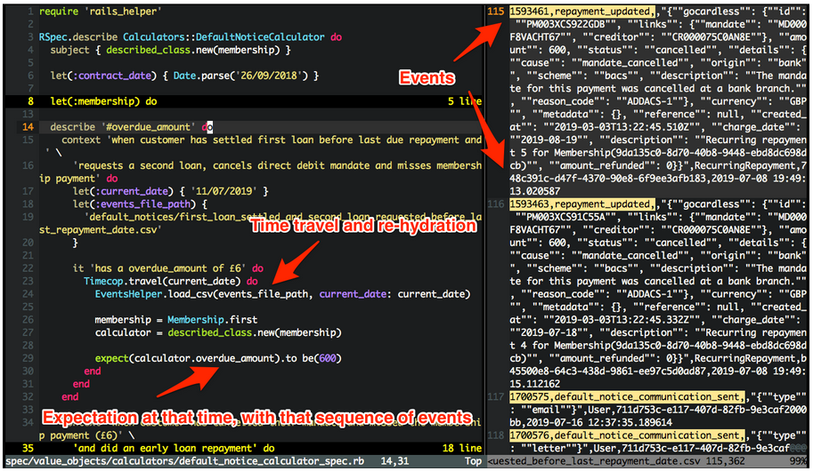

Welcome back to Not So Random Software. This week's links are dedicated to Observability; the capability to observe the system's current state and how the system reached such a state. I have been researching this topic for a lightning talk at the London Ruby User Group and here are some of the links I found.

## A random article or paper

You know if a given Software Engineering topic is legit when Martin Fowler has a definition on his blog; here is the one for _Domain-Oriented Observability_, the practice of observing your system using the _Ubiquitous Language_ of your domain.

## A random video or podcast

In this talk, Bernd Ruecker — co-founder and developer advocate at Camunda — describes how the industry is currently focusing on building decoupled event-driven systems and observe their emerging behaviour. With such an approach we are left with a gap between the technical sphere and the business sphere; people need to understand how the system works. Workflow engines and DSLs — despite their bad reputation — can bridge the gap between the two worlds.

## A random book

I think Observability has a lot to do with testability. The only difference is that testability is very much focused on the short term, while observability is focused on the long term aspect of helping people re-test the functionality over and over. I don't have a book on how to design Observability I am afraid — and please send it over in the comments if you have one — but for code discovery using tests, the reference is always Growing Object-Oriented Software, Guided by Tests.

## A random tool

One of the simplest ways to make your software more observable is by adding an impersonation feature. This simply lets you see what a given user is currently observing so you easily investigate your application behaviours (or misbehaviours!). The pretender gem maintained by Instacart is the reference implementation in the Rails community for such a feature.

## A random line of code

When using an event sourcing system you can easily observe your state history by inspecting the events log. As an added benefit you can also write tests around complex event log scenarios, like in the example below.

## A random quote

> Any fool can write code that a computer can understand. Good programmers write code that humans can understand.
> 
> Martin Fowler

## Receive this by email

\* indicates required

Email Address \*  
  

