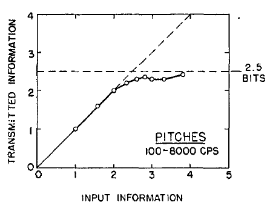

Welcome back to Not So Random Software, this week's links are dedicated to Memory! No, I am not talking about computer memory like how to design your perfect caching strategy, but human memory...but are the two actually so different? Join me in this random walk.

## A random article or paper

How much information the average person can keep readily available in their mind? Apparently, it's seven elements, plus or minus two! The paper "The Magical Number Seven, Plus or Minus Two Some Limits on Our Capacity for Processing Information" by George A. Miller from Harvard University in 1956 (!) explains why.

<figure>



<figcaption>

In this experiment participants were presented with various tones to identify, but starting at 2 bits (4 tones) their accuracy started deteriorating. The limit is 2.5 bits (7 tones).

</figcaption>

</figure>

## A random video or podcast

In this podcast columnist and neuroscientist Dr Daniel Glaser delves into the complex world of episodic memory. With King’s College London neuropsychologist Dr Charlotte Russell as his guide, Daniel explores how and where memories are stored, how reliable these memories are and whether computers – like our brains – show ‘graceful degradation’ of memory.

## A random book

If you are interested in all the ways memory can trick your mind, then Thinking, Fast and Slow by by Daniel Kahneman is the reference book. If you are short on time, here is a quick cheatsheet of the most important memory biases!


## A random tool

When it comes to memorizing information my go tool is always Anki flashcards. Personally I find it super useful to write down my notes there when I finish reading a book to later recall these learning, definitely a difficult habit to practice but totally worth it.

## A random line of code

You are hunting down a memory issue on a gem but can't quite point out where it is? The Ruby NewRelic gem does a great job to help you annotate a method and measure its running time, here is how!

```
require 'new_relic/agent/method_tracer.rb'

YourGemClassName.class_eval do
  include NewRelic::Agent::MethodTracer

  add_method_tracer :call
end
```

## A random quote

> People are almost always confronting what computer science regards as the hard cases. Up against such hard cases, effective algorithms make assumptions, show a bias toward simpler solutions, trade off the costs of error against the costs of delay, and take chances. These aren’t the concessions we make when we can’t be rational. They’re what being rational means.
> 
> Christian, Brian. Algorithms to Live By

## Receive this by email

\* indicates required

Email Address \*  
  

<script type="text/javascript" src="//s3.amazonaws.com/downloads.mailchimp.com/js/mc-validate.js"></script>

<script type="text/javascript">(function($) {window.fnames = new Array(); window.ftypes = new Array();fnames[0]='EMAIL';ftypes[0]='email';fnames[1]='FNAME';ftypes[1]='text';fnames[2]='LNAME';ftypes[2]='text';fnames[3]='ADDRESS';ftypes[3]='address';fnames[4]='PHONE';ftypes[4]='phone';fnames[5]='BIRTHDAY';ftypes[5]='birthday';}(jQuery));var $mcj = jQuery.noConflict(true);</script>
