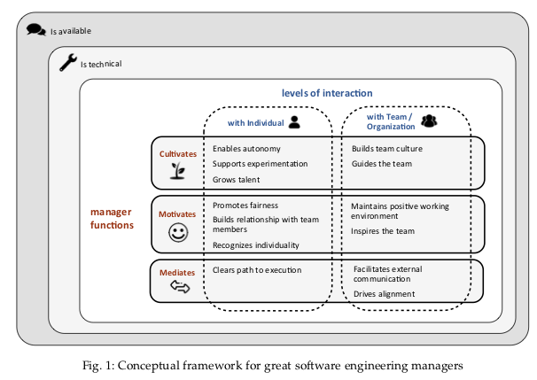

Welcome back to Not So Random Software, this week's links are dedicated to team values. Team values help you define what a great job looks like; you might value _speed over quality_, or you might value _working together over_ _fully delegating to the experts_. These are not easy choices to make because each choice works well in different contexts but effective teams need to make consistent choices to stay aligned. Enjoy this random walk!

## A random article or paper

Managers are responsible for constantly promoting and communicating company values; so what makes a great manager of Software Engineers? This paper published in the IEEE Transactions on Software Engineering conducted a mixed-methods empirical study of software engineering management at Microsoft to investigate what manager attributes developers and engineering managers perceive important and why. No time to read? Here is a picture!



## A random video or podcast

In this insightful and hilarious conference talk at Monktoberfest 2017, Bryan Cantrill presents good and bad principles of technology leadership at various tech companies and what you can do to make sure you get yours right. Have you ever asked yourself what's the difference between a _Principle_ and a _Value_? If not probably time to investigate!

## A random book

If the book The Five Dysfunctions of a Team the author Patrick Lencioni presents the story of a misaligned leadership team and how the got back together by leaning into conflict to eventually find a common purpose they are all excited about.

## A random tool

Your values should really be extracted by your team behaviors, but sometimes _noticing_ and _being mindful_ of what's happening around you is a hard skill to master. If you feel stuck you can find inspiration by looking at the open career ladders at progression.fyi.

But what do values have to do with career ladders? Ladders explicitly list what are the behaviors employees should demonstrate in order to be recognized by their peers — and that's a statement of values for that specific team.

## A random line of code

If you think values do not apply to code you should check the Rails Doctrine or the Zen of Python to see how values translate into code design choices. For example, in Python, _there should be one-- and preferably only one --obvious way to do it_. But that's not what Ruby — a language designed for developers' happiness — optimize for when it offers multiple synonyms in the standard library methods; see this example from the Enumerable module.

```
(1..10).detect { |i| i % 5 == 0 && i % 7 == 0 }   #=> nil
(1..10).find { |i| i % 5 == 0 && i % 7 == 0 }   #=> nil
```

## A random quote

> What we’ve learned is that the soft stuff and the hard stuff are becoming increasingly intertwined. A company’s values—what it stands for, what its people believe in—are crucial to its competitive success. Indeed, values drive the business.
> 
> Rober Haas, CEO Levi Strauss & Co

## Receive this by email

\* indicates required

Email Address \*  
  

<script type="text/javascript" src="//s3.amazonaws.com/downloads.mailchimp.com/js/mc-validate.js"></script>

<script type="text/javascript">(function($) {window.fnames = new Array(); window.ftypes = new Array();fnames[0]='EMAIL';ftypes[0]='email';fnames[1]='FNAME';ftypes[1]='text';fnames[2]='LNAME';ftypes[2]='text';fnames[3]='ADDRESS';ftypes[3]='address';fnames[4]='PHONE';ftypes[4]='phone';fnames[5]='BIRTHDAY';ftypes[5]='birthday';}(jQuery));var $mcj = jQuery.noConflict(true);</script>
