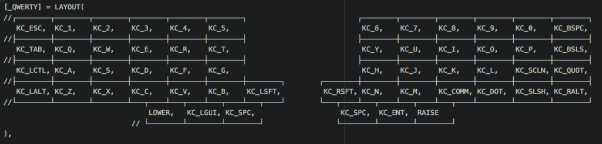

Hello everyone and welcome back to Not So Random Software! This week I am thinking about business value and what are the signals we should listen to in order to maximize it over time. In Agile we start with business value as presented in the manifesto:

> Our highest priority is to satisfy the customer through early and continuous delivery of valuable software.

Which leave the open questions of…who is the customer? and what is valuable? For me personally, Agile has constantly changed over time. I have seen teams adapting their style every 6 months over 4 different companies for 9 years.

I am only one data point in an infinite sea of data points, but my experience begs for the question; are people constantly adapting because we trying to solve something that does not inherently have an optimal well-defined solution? Probably.

Mathematicians are smart as they try to prove that a solution exists before trying to solve a problem; with humans, we can't do that. However, for peace of mind is good to question whether something is hard and inherently unsolvable.

Hope you enjoy this random selection of links!

## A random article or paper

On the Economic Evaluation of XP projects

When trying to defines business value the NPV is a well-known metric used in finance. This paper analyses that the economic value of XP projects solely based on such metrics and their findings show that getting a high return on your software project strongly depends on how faster you can be with XP, the degree of defect reduction, and level of market pressure.

## A random video or podcast

Next generation Ruby Web Apps with dry-rb at RedDotRubyConf 2016

As a community, we always try to improve our tools to deliver web applications faster and with fewer defects. Ruby on Rails came to the open-source market to revolutionize the speed at which we deliver value by offering a selection (_omasake_) of good defaults to build web applications. The mantra of convention over configuration has been praised for years after its release.

However, there are also lots of people out there who do suffer the pain of legacy web applications who got out of control. The dry-rb project offers a set of small, functional, and decoupled libraries that are designed to set you up for success in the long term rather than the short term. It's a difficult decision to make and there is definitely a price in deliberately avoiding conventions, but nevertheless something you should consider if you are running a marathon and not a sprint.

## A random book

The Art of Business Value

This book that inspired this blog post today. I am only a few chapters in but the question of what Business value actually is and if we are any close to be able to define it is an intriguing one.

## A random tool

Keybr.com - Learn Touch Typing online

No matter how you define business value, as Andy Grove used to say we can either perform our activities at a higher rate or increase the leverage of the activities. Finding the best leverage is hard, so why not be lazy for a minute and just try to type faster? This online tool is a great place to practice touch typing. I am currently at 80 words per minute but if you look at the hall of fame there are some quite incredible stats!

## A random line of code

Have you ever wondered how a keyboard layout array would look like? I stumbled upon it while configuring my first mechanical keyboard Iris Rev4. Started from the default configuration and ended up here for the main layer!

## A random quote

> Always turn a negative situation into a positive situation.
> 
> Micheal Jordan

## Receive this by email

\* indicates required

Email Address \*  
  

