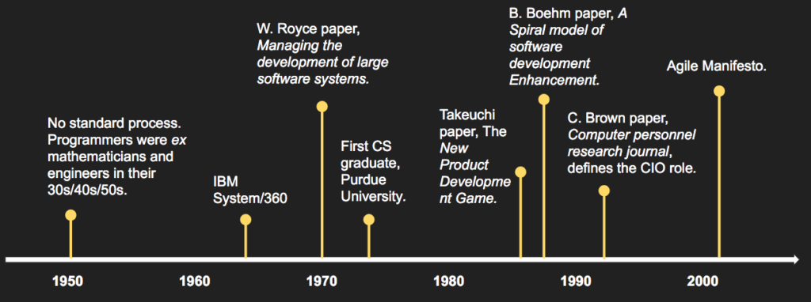
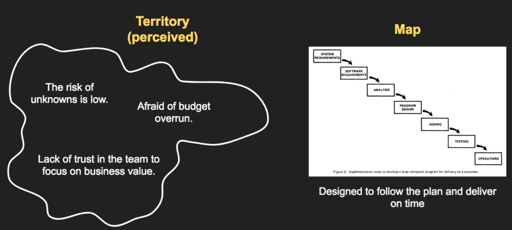
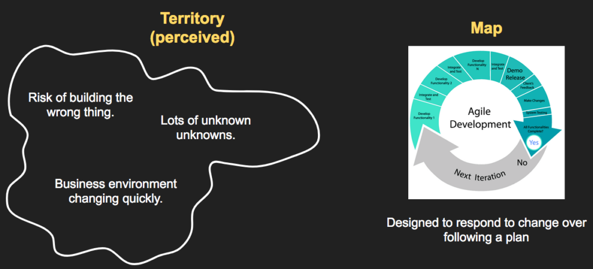
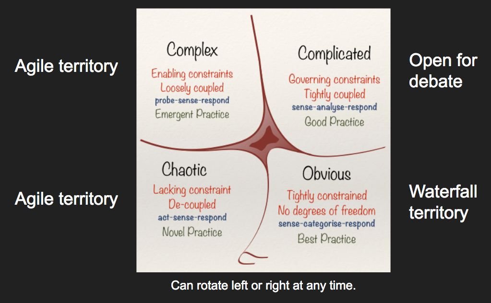
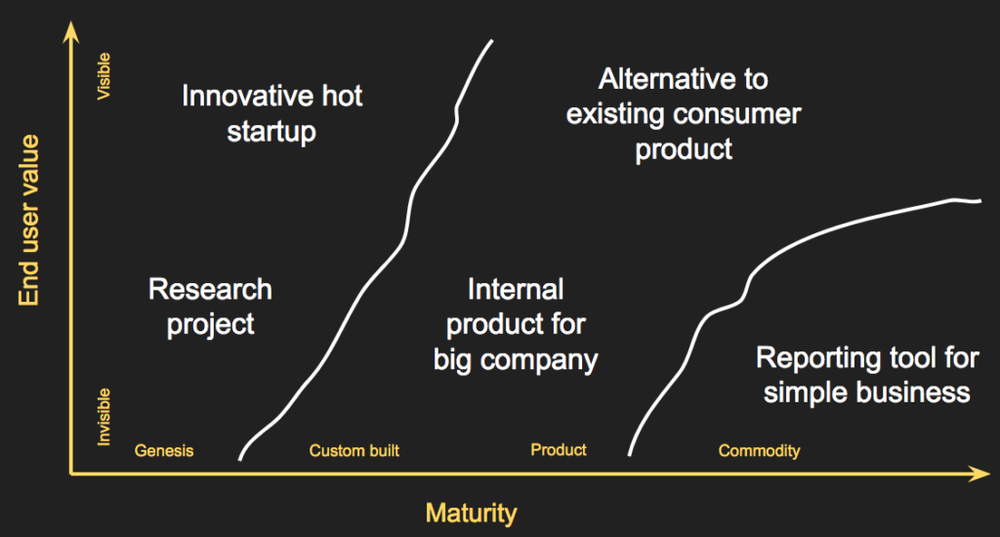
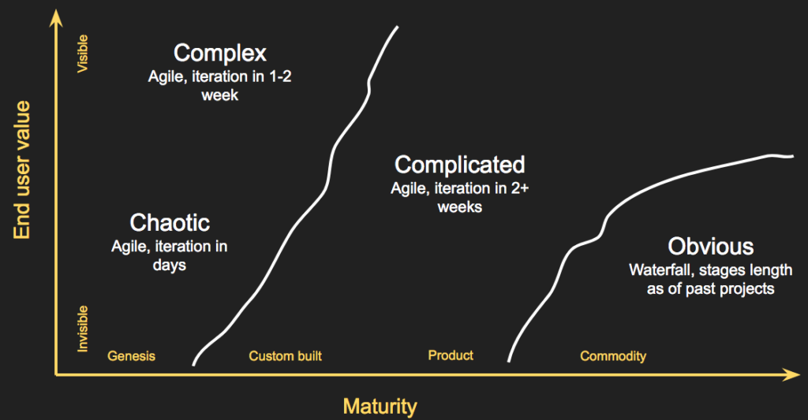

Today Agile is the default choice for the software development life cycle (SDLC); every conference, book, or blog post is telling us we are doomed to fail if we don’t follow this established convention. But isn't it surprising to think that we should use Agile for every possible company doing software out there? Are we going to organize software development exactly the same way if we work for a startup, NASA, or FedEx? It seems hard to believe.

If you are already screaming _this is heresy! ...p_lease bear with me; I am not trying to send us back to the dark ages of Waterfall. At the same time, no project or company is the same and we should keep thinking about _Why_ we do what we do. Choosing the appropriate SDLC requires a deep understanding of the dynamics of your environment.

In this blog post, I will use the lenses of risk management to help you pick what SDLC is right for you. We will first interpret the SDLC as a map for your risks landscape. We will then look a the history of Agile and Waterfall and why these risk maps make sense in their own context. Finally, we are going to learn how to use Cynefin and Wardley as tools to better understand the uniqueness of your risk territory, so you can pick the SDLC that better suites your team or company profile.

I hope you enjoy the journey and looking forward for your thoughts in the comments.

### The Map and the Territory

Imagine you are planning a mountain hike (say on the Dolomites in Italy). If it's a summer day, you are probably looking at clear skies and perfect visibility. If it's wintertime, you might be faced with ominous clouds, thunderstorms, and fog with very low visibility. You would not prepare for a winter hike in the same way you would prepare for a summer one. The territories are completely different and so are the risks you might be facing. For example, on a summer day, you can easily plan for how long the hike will take. For a winter day, it's hard to tell because the weather conditions might change anytime, and so your schedule.

You can think of the software project you are working on as the territory you are dealing with. Sometimes we will be facing a summer day, some other times we are facing a winter thunderstorm. It is crucial for you to know which one it is so you can prepare appropriately. To navigate such different risk profiles, you need a map. If you are going for a relaxed summer hike you want a map where footpaths are highlighted. If you are going to do climbing, you need to know if the path you have chosen it is at risk of landslides. They are both mountain hikes, but remarkably different, and so are the maps you need.

So how does picking your map look like for software?

If you think about Waterfall and try to understand the reason why it became so popular, you need to go back in time to understand the historical context. In the 50s there was no standard development process, and programmers were mostly mathematicians, and engineers with a bunch of experience who, over the course of two decades, built big systems like the IBM System 360 (see _The Mythical Man-Month_ by Fred Brooks). They were working with short iterations guided by their experience and capability to navigate risks. In the 70s we had the first computer science graduates coming out of University and the general feeling was that the industry had to streamline software development to onboard these young engineers.

In 1970 the Winston Royce paper, _Managing the development of large software systems_, is very much welcomed by the entire community as a way to organize software development. It took us another 20 years to realize that something was not quite working when the Takeuchi paper _The New Product Development Game_ came out describing a different way to build products with overlapping stages rather than strictly sequential ones. They say a picture is worth a thousand words, so here is a summary:

So why we did pick Waterfall in the 70s as the _right way_ to organize software development? It is because the _map_ made sense when compared with the perceived risk territory at that time. The hypothesis of Robert C. Martin (presented in this Changelog podcast) was that software development in the 70s was the perfect fertile ground for something like Waterfall.

We did not pick this model purely because of lack of experience, but also because the Waterfall model made sense for the type of territory we were facing. People were (a) overly confident in their capability of writing good requirements, (b) afraid of budget overruns as most projects did not finish on time, and (c) lacking trust in the young graduates coming out of university. The Waterfall map for these risks made perfect sense; a map designed to _follow the plan and deliver on time._

Unfortunately, many people misinterpreted the Winston Royce paper and we made the mistake of picking the Waterfall methodology as the only appropriate methodology for software development (and stick with it for at least 30 years). When Agile came into place the perception of the territory was very different compared to the 70s. People were much more aware that (a) there is a high risk of building the wrong thing (see the Lean startup literature as a good example of this), (b) we often don't know what we don't know so we end up with unexpected blockers at the worst possible time during any project, and most important of all (c) business does change so quickly that our software is constantly adapting to the environment rather than trying to solve for a static view of the world. Short iterations, sprint demos, and retrospectives address a lot of these issues, and this is why the Agile map is so well received today.

In a way, Agile and Waterfall can be framed as risk management techniques sitting at the two ends of the same spectrum. Knowing what risk territory you are dealing with is key to pick the right SDLC. In the next section, I'll present two simple tools that I found incredibly valuable to ready the risk territory and pick the right SDLC; Cynefin and Wardley maps.

### Cynefin and Wardley to ready your territory

You might be tempted to summarise the previous section with this conclusion. If...

- You think the risk of unknowns is very low.
- You think there is a high risk of budget overrun.
- You cannot trust the team will avoid waste and focus on business value.

then you should use Waterfall. If instead...

- You think there is a risk of building the wrong thing.
- You think there is a risk of the business environment changing too quickly.
- You think there are a lot of unknown unknowns.

then you should use Agile. I find this interpretation to be too simplistic, so I started researching more options. This is how I stumbled upon the Cynefin framework, a conceptual framework used to aid decision-making created in 1999 by Dave Snowden at IBM Global Services.

Cynefin is a Welsh word that stands for _habitat_ and it provides a simple taxonomy for projects with an increasing amount of uncertainty and what strategy is appropriate for each of them. In short, there are four types of environments:

- Simple / Obvious / Clear project; You deal with "known knowns", for example when working on standard operating procedures. Here you follow the best practices that have been established already (_Best practice_).
- Complicated projects; You deal with "known unknowns". The relationship between cause and effect requires analysis or expertise and there is a range of right answers.  With expertise and a clear context, your challenges should have a clear solution (_Good practice_).
- Complex projects; You deal with "unknown unknowns". Cause and effect can only be deduced in retrospect. Your very actions change the situation in unpredictable ways. Here there are no right answers and experimentation is key to establish what are the rules that govern your territory (_Emergent Practice_).
- Chaotic projects; Cause and effect are unclear. Events in this domain are too confusing to wait for a knowledge-based response. You need to first put order to transform the situation from chaos to complexity (_Novel practice_).

Based on these descriptions you can guess what SDKC is appropriate for the environment. In _Obvious_ environments, you are dealing with known knows and Waterfall should feel like a natural choice. Starting from _Complicated_ it is open for debate depending on the context. Think about the process of building an airplane. It is complicated but it has definitely been done before many times; with the right expertise and all the information available (is that for commercial flights, or short flights) you can sequentially plan your project, but if the context is missing then you need to work in iterations to find out. Finally, Complex and Chaotic environments are the natural place for Agile techniques. You need to find a cause-effect relationship and the only way to do so is by building and testing hypotheses in your environment as quickly as possible.

I think most projects today are Complex in nature and this is why Agile is (rightly) so popular in today's business environment.There are no right answers, you can’t call an expert to tell you what to do and you need to trust the team to let them figure it out. Good Agile teams are not afraid of changing direction and updating their mental map; they know it’s a process of constant experimentation.

If this still feels a bit too abstract another similar tool that serves the same purpose is Wardley maps. This talk at InfoQ in 2019 is a great introduction to the topic. On the Y-axis you put the End-user value; how visible the value you are offering is to the marketplace. On the X-axis you put the evolution of such offer; you might be offering something that is completely new and at the early stages of development, or something that has become a commodity. If you need to place your product of company into this map this is how it might look like:

When you start thinking in these terms you realize how the different products and companies actually live at different ends of the risk territory spectrum and how you might want to use a different project management technique for each of them. If your product/company is very young and the end-user value is not visible just yet (think about blockchain startups around 2011-2012) the more you are leaning towards risky territories (Complex or Chaotic in Cynefin terms) where you want to apply Agile techniques. If instead your product/company is quite mature, the end-user understands the value of your solution and they are most interested in making it as cost-effective as possible, then you are into the Obvious territory and Waterfall might be perfectly fine for that.

At the same time be careful of making assumptions on a domain that looks simple, but for various reasons, it might not be anymore. Both Wardley maps and the Cynefin framework are dynamic in nature, not static. In Cynefin as knowledge increases, there is a "clockwise drift" from chaotic through complex and complicated to simple. However, you might easily end up in a situation where a "buildup of biases", complacency or lack of maintenance can cause an additional clockwise movement from simple to chaotic! For Wardley maps innovation and disruption can change the territory anytime, moving your product from left to right if you get commoditized but also from right to left if something changes the rules of the game (for example, the smart grid might make move power from a commodity on the right back to the left).

### Conclusion

So where is your project on the risk territory? Should you pick Waterfall or Agile? As I have tried to outline here this question is not as straightforward as it might have seemed initially.

Agile or Waterfall are like maps; they help you navigate the risk territory of your project. There is no such thing as the perfect map, _it depends_. You need to understand your territory first by looking at the unique characteristics of your project/company. Said so, it is true that most territories in software development are _complex, chaotic, or complicated_. The characteristics of such territories are defined in the Cynefin framework which can be used to determine which of these circumstances apply to you and tailor your Agile response accordingly. If that still feels too abstract you can also use Wardley maps which helps you orientate based on project maturity and perceived end-user value.

I hope this article helped you reflect on what's appropriate for your team and be confident that your choice matches the risk profile of your project. I am very much looking forward to your comments, so let me know your thoughts or tweet me at @mottalrd
