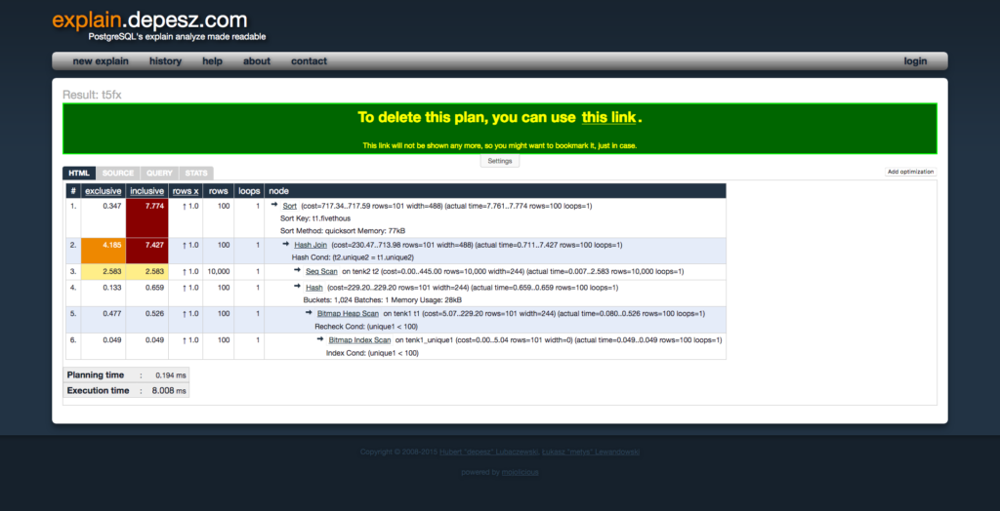

Hello everyone and welcome back to Not So Random Software!

This week I have been thinking about teams and specifically about how trust is build and broken. Creating trust and engagement in an ever-changing environment business environment is definitely not an easy job. I hope some of these links will inspire you if you are facing the same.

Enjoy the random walk!

## One article or paper

The Change Compass

In this article, the author presents a simple Change Compass to be used in retrospectives to measure team morale and engagement. Haven't tried it yet, but I am a big believer in turning literally everything into data, so I will give it a try. The compass has four quadrants: Improving, Stormy, Worsening, Calm.

## One video or podcast

a16z Podcast: How to Decide, Convey vs. Convince, & More

In this podcast from Silicon Valley investor firm Andreessen Horowitz the author of Thinking in Bets and former Poker player Annie Duke is interviewed to talk about her new book: HOW to Decide: Simple Tools for Better Choices. There are some good insights there on how all our decision moments are traps for human biases to emerge.

## One book

Team topologies: Organizing Business and Technology Teams for Fast Flow

If your business, your industry, the world, and user perceptions are constantly changing, why aren't you changing your team topologies? Successful teams are at the heart of making software, and this book goes into the details of how successful teams look like.

## One tool

https://github.com/tridactyl/tridactyl

Did you know that you can use your browser using vim-like commands? I know, it's crazy, but if you are a VIM user you should give it a try. Your wrists at the end of the day will thank you.

## One line of code

If you are finding yourself debugging SQL queries for performance you might have come across Postgresql EXPLAIN ANALYZE before. Here is an example of how a plan looks like from this article.

```
EXPLAIN ANALYZE SELECT *
FROM tenk1 t1, tenk2 t2
WHERE t1.unique1 < 100 AND t1.unique2 = t2.unique2
ORDER BY t1.fivethous;
```

and this is the plan

```
 Sort  (cost=717.34..717.59 rows=101 width=488) (actual time=7.761..7.774 rows=100 loops=1)
   Sort Key: t1.fivethous
   Sort Method: quicksort  Memory: 77kB
   ->  Hash Join  (cost=230.47..713.98 rows=101 width=488) (actual time=0.711..7.427 rows=100 loops=1)
         Hash Cond: (t2.unique2 = t1.unique2)
         ->  Seq Scan on tenk2 t2  (cost=0.00..445.00 rows=10000 width=244) (actual time=0.007..2.583 rows=10000 loops=1)
         ->  Hash  (cost=229.20..229.20 rows=101 width=244) (actual time=0.659..0.659 rows=100 loops=1)
               Buckets: 1024  Batches: 1  Memory Usage: 28kB
               ->  Bitmap Heap Scan on tenk1 t1  (cost=5.07..229.20 rows=101 width=244) (actual time=0.080..0.526 rows=100 loops=1)
                     Recheck Cond: (unique1 < 100)
                     ->  Bitmap Index Scan on tenk1_unique1  (cost=0.00..5.04 rows=101 width=0) (actual time=0.049..0.049 rows=100 loops=1)
                           Index Cond: (unique1 < 100)
 Planning time: 0.194 ms
 Execution time: 8.008 ms
```

but reading it should be _that_ hard, here is why tools like explain.depesz.com come to the rescue.



## One quote

> In large companies and gov't organizations “fear of failure” inhibits speed and risk-taking, while in startups “fear of failure” drives speed and urgency
> 
> Steve Blank

## Receive this by email

\* indicates required

Email Address \*  
  

<script type="text/javascript" src="//s3.amazonaws.com/downloads.mailchimp.com/js/mc-validate.js"></script>

<script type="text/javascript">(function($) {window.fnames = new Array(); window.ftypes = new Array();fnames[0]='EMAIL';ftypes[0]='email';fnames[1]='FNAME';ftypes[1]='text';fnames[2]='LNAME';ftypes[2]='text';fnames[3]='ADDRESS';ftypes[3]='address';fnames[4]='PHONE';ftypes[4]='phone';fnames[5]='BIRTHDAY';ftypes[5]='birthday';}(jQuery));var $mcj = jQuery.noConflict(true);</script>
