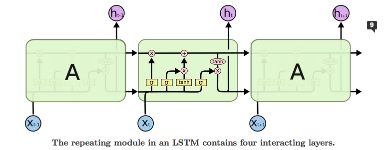

Hello everyone and welcome back to Not So Random Software!

This week I have been thinking about memory and how the simple act of remembering can help you put things into perspective and recalibrate your happiness meter.

Enjoy the random walk!

## One article or paper

Why Smart People Fail To Be Happy

Niklas runs a very insightful self-help newsletter and I enjoyed this recent article on how we are often the main cause of our unhappiness. Niklas lists these 5 factors who did resonate with me:

- We overthink; mostly worrying about the future
- We expect too much; even when many factors are outside our control
- We push people away; because we are always competing, skeptical and distrusting
- We sabotage ourselves; by always demanding an explanation for failure when sometime there is none
- We devalue happiness altogether; because we think we must earn it somehow

## One video or podcast

How to build a company where the best ideas win?

In this classic Ted talk Ray Dalio, hedge fund manager, and philanthropist who has served as co-chief investment officer of Bridgewater Associates, presents his philosophy on how to build a company based on Idea Meritocracy; not an Autocracy, where the leader decides, not a Democracy, where everyone vote counts the same, but an Idea Meritocracy, where people are encouraged to stress test ideas and see things within the lenses of collective thinking.

## One book

If You're So Smart, Why Aren't You Happy?

A Business school professor examines happiness, with some insightful conclusions. When it comes to happiness even if you are smart you do make some strikingly dumb assumptions about what it is and how to get it!

## One tool

Sofa Desks for your working from home setup

In a world where working from home is the new normal, I found sofa desks to be a great option to mix up your day between standing, sitting on a chair, and working from the sofa, all without hurting your back.

## One line of code

When trying to model memory, LSTM neural networks made several breakthroughs in the last 5 years. This is how simple it is to create one using the Keras library:

```
>>> inputs = tf.random.normal([32, 10, 8])
>>> lstm = tf.keras.layers.LSTM(4)
>>> output = lstm(inputs)
>>> print(output.shape)
(32, 4)
>>> lstm = tf.keras.layers.LSTM(4, return_sequences=True, return_state=True)
>>> whole_seq_output, final_memory_state, final_carry_state = lstm(inputs)
>>> print(whole_seq_output.shape)
(32, 10, 4)
>>> print(final_memory_state.shape)
(32, 4)
>>> print(final_carry_state.shape)
(32, 4)
```

But if you want to understand how this works conceptually, take a look at this great article. One picture is worth a thousand words. The architecture of the network smartly selects from examples what to remember and for how long much for efficiently compared to a standard recurrent neural network.



## One quote

> Rather than thinking, "I’m right." I started to ask myself, "How do I know I’m right?"
> 
> Ray Dalio

## Receive this by email

\* indicates required

Email Address \*  
  

<script type="text/javascript" src="//s3.amazonaws.com/downloads.mailchimp.com/js/mc-validate.js"></script>

<script type="text/javascript">(function($) {window.fnames = new Array(); window.ftypes = new Array();fnames[0]='EMAIL';ftypes[0]='email';fnames[1]='FNAME';ftypes[1]='text';fnames[2]='LNAME';ftypes[2]='text';fnames[3]='ADDRESS';ftypes[3]='address';fnames[4]='PHONE';ftypes[4]='phone';fnames[5]='BIRTHDAY';ftypes[5]='birthday';}(jQuery));var $mcj = jQuery.noConflict(true);</script>
