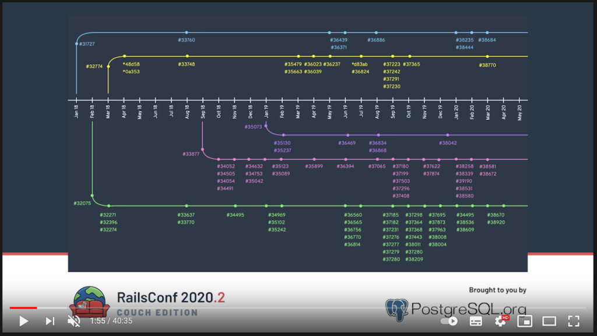

Hello everyone and welcome back to Not So Random Software!

This year I have inherited a Data team and I am getting up-to-speed on what can be done to make the team thrive. I am learning how data is a complicated topic and team alignment is as much important as the tech behind it. Teams first, Tools second.

Enjoy the random walk!

## One book

Creating a Data-Driven Organization

Data is a complicated matter; there is an element of Skills (SQL, Python), an element of Architecture (Data Warehouse, batching, streaming, pipelines), and an element of Governance (what's the definition of metric X?). This book covers a lot of these topics. It made me realize that picking the Tool or Architecture is only half of the equation. Much more important in a changing landscape to define the roles and the team structure before jumping into tools.

## One article or paper

The future of Data Engineering

To support an evolving Data-Driven organization you need strong foundations and a constant evolution of your data workflows. In this blog post I enjoyed the various stages of the Data architecture at WePay and how you know it is time you need to transition from your current workflow to the next. It is a great example of Evolutionary Architecture.

## One video or podcast

RailsConf 2020 CE - Keynote: Technically, a Talk by Eileen Uchitelle

In this video Eileen Uchitelle presents the story of adding multiple database support for Rails. I was impressed by the amount of work that the core team had to put in order to enable such functionality and I believe it greatly empower teams to build applications that are more future proof. Not everyone need multiple databases, but sometimes you really do.



## One tool

Debezium

Event driven architectures are super-handy for building relational table projections that can be used for analytics / data warehousing. But what if you don't have events? Debezium is an open source distributed platform for change data capture. Start it up, point it at your databases, and your apps can start responding to all of the inserts, updates, and deletes that other apps commit to your databases. These might not be as expressive as domain events, but it does the trick for a lot of use cases.

## One snippet of code

Step up your debugging game by using Kernel#caller\_locations. It a stacktrace with file locations you can look up for editing. Couple it with bundle open and you have full control over the code you are running. Thank you to Jemma Issroff for sharing on Ruby Weekly.

```
def method_one
  caller_locations # returns an array with the path to callers
end

def method_two
  method_one # line 6
end

def method_three
  method_two # line 10
end

array_with_callers = method_three # line 13
pp array_with_callers
```

```
$ ruby example.rb
["example.rb:6:in `method_two'",
 "example.rb:10:in `method_three'",
 "example.rb:13:in `<main>'"] 
```

## One quote

> The less you want, the richer you are. The more you need in order to be happy, the more miserable you’ll be.
> 
> Yiannis Chryssomallis

## Receive this by email

\* indicates required

Email Address \*  
  

<script type="text/javascript" src="//s3.amazonaws.com/downloads.mailchimp.com/js/mc-validate.js"></script>

<script type="text/javascript">(function($) {window.fnames = new Array(); window.ftypes = new Array();fnames[0]='EMAIL';ftypes[0]='email';fnames[1]='FNAME';ftypes[1]='text';fnames[2]='LNAME';ftypes[2]='text';fnames[3]='ADDRESS';ftypes[3]='address';fnames[4]='PHONE';ftypes[4]='phone';fnames[5]='BIRTHDAY';ftypes[5]='birthday';}(jQuery));var $mcj = jQuery.noConflict(true);</script>
