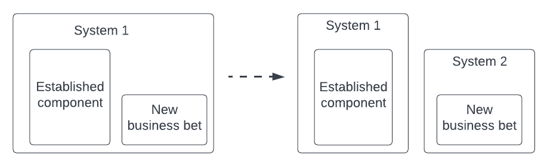
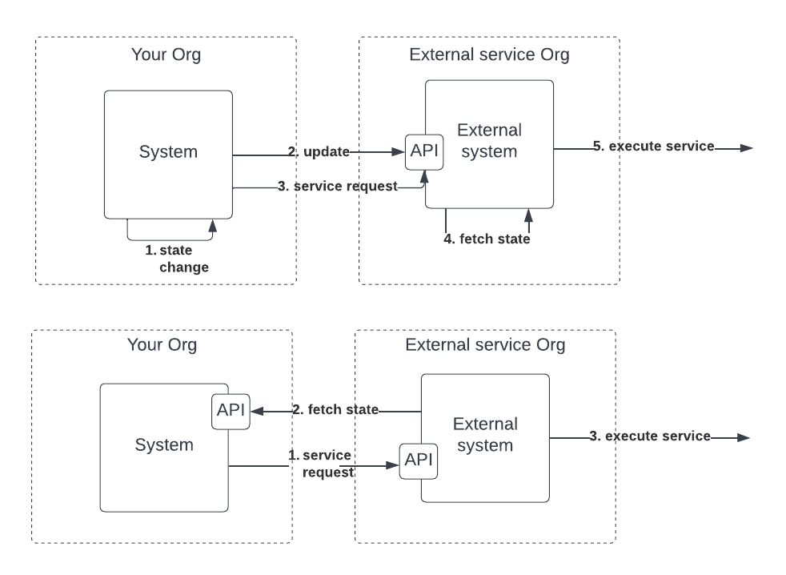
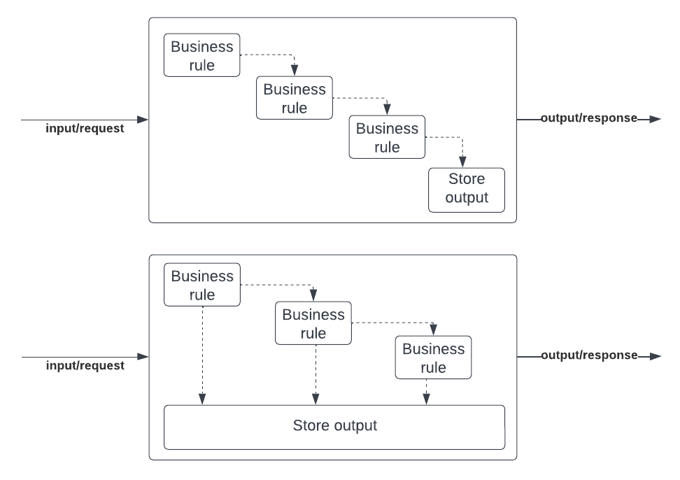

# Introduction

These are some of the lessons that I have learned over my 5 years at a Fintech startup that went from 0 to 100k customers and grew the team from 4 to 50 people.

It would be hard for me to identify what we did to put us in this fortunate position; the market conditions, the product execution, the team we built, the Engineering choices we made, and a healthy dose of luck all contributed to where we are today as a company. I am not going to cover these, I am sorry!

This blog post is about the _messy middle_ instead, all the choices I am still puzzled about that I might consider doing differently if I could go back in time. Like everything in Software Engineering, these are not hard truths but tradeoffs to consider if you were to stumble upon the same challenges.

Enjoy the read 🙇‍♂️

# The messy middle

When you are talking about _scale_ in a startup we usually refer to two components; scaling teams and scaling the technology. I will mostly focus on the latter as the former would require its own separate talk.

When I say scaling the technology I refer to two specific properties; scaling with the customer growth and scaling with the team growth. The former usually overlaps with the performance of the system; think about availability, reliability, etc. The latter usually overlaps with the system usability, auditability, or extensibility. These all fit into one form or another of non-functional requirements as identified in the Wikipedia entry list \[4\] but I think it's important to keep this distinction in mind; scaling the customer base, or scaling the team.

In an ideal world, we'd like to imagine someone walking into our office and clearly outlining all the non-functional properties of our system that need to be implemented. Well, the sad reality is that this is only true in around 20% of the cases that I have experienced. The remaining 80% fit into _the messy middle_ we are going to cover in this talk. In those, you are not quite sure whether the system you are building will be key to your customer growth, and whether it is well designed for the growth of the team. These uncertainties will reflect in your design choices creating some of the puzzling outcomes outlined in this blog post.

Let's dive in 🏊‍♂️

# There are always n+1 systems

When you are just starting out and you don't have your first customer yet there are about a million things you don't know. Is there a market for what I am offering? Are my business plan assumptions correct? Will the system we built work as intended without major bugs or flaws? Can we support the day-to-day business operations as the customer base grow?

None of this naturally points you to data reporting as something you should be concerned about; surely you can get your data out with a few SQL queries or by integrating with an off-the-shelf tracking tool like Google Analytics or Mixpanel! Let me tell you - nothing is farther from the truth. I have learned the hard way that no matter how many systems you split your design into (for us it was two to start), you will always have to build an n+1 system; data reporting.

We went from custom SQL queries passed around the office, to visualization tools hooked into the operational database, to rudimentary data pipelines that loaded CSV files into advanced visualization tools. It took 3 long years and getting over 50k customers before we decided to staff and build the data reporting system.

If you have heard of Conway's law \[1\] you know that software will ultimately reflect the structure of your organization. When working in a startup you need to think and practice the Inverse Conway's law maneuver \[2\]; build the data reporting system first, so your organization can be data-driven from the start and build a team around a well-designed software, rather than playing catch-up later on.

# Separate components based on scalability needs

Thinking about Conway's law will get you far in designing your system, but as with every rule in Software Engineering, it's important to know when you should consider breaking it. Here is an example of that.

I stumbled upon this use case early on when we had to build our first API in 2019 shortly after the launch of the business. The API enables our partners to send us potential customers. We thought most customers would be acquired via social media channels and paid search but turned out that 50% of our customers are acquired through the API channel instead. It is a key acquisition channel for a lending business. 3 years later we are continuously adding new partners to that channel and each of them sends us a different volume of API requests on a daily basis. We run at 400-500 RPM but spikes in volume due to marketing campaigns can double the RPM easily.

Everything around Conway's Law would indicate that our system design is fit for purpose; we have a technical team responsible for customer acquisition and paying customers' account section. This team maintains the API and account section which live in the same codebase and deployable unit. The human element is well designed, but the availability and reliability requirements of the system put the team in a rather difficult situation. If API volumes suddenly spike because of marketing campaigns out of our control done by external partners, the same system hosting the account section is subject to a degradation in performance. In other words, the API does not scale independently of the account section.

There are mitigations that we have been able to put in place like autoscaling on Heroku but the fundamental tradeoff remains. I still believe there are plenty of arguments in favor of the existing design (e.g. fewer systems to maintain, shared components between the two systems) but I wish we made the choice more explicitly back then. Our technical solution couples two lines of business (acquisition and retention) that should ideally be decoupled from each other - we didn't think of it that way back then.

Another way to look at the same coupling from a different point of view is by using the design heuristic from Kent Beck; "Things that change at the same rate belong together. Things that change at a different rate belong apart" \[3\]. We did not change the design of our API since we launched it in 2019, but at the same time, we did thousand of deploys associated with the organic acquisition journey and the account section. This suggests that API is considerably more stable than the other journeys and we should consider extracting it in a separate system.

# Separate components based on business bets

This is one of these lessons that I feel I might never get right even if I end up in the same situation in the future, for two reasons; it is hard to sell as a business investment and it is hard to believe you are doing the right thing when you take the bet.

Starting a new line of business from an existing one is really hard. Using the Lean Startup terminology you are scientifically testing a hypothesis about a new market you want to capture. The difference is that this time you have a system and a team in place, so it makes absolute economical sense to reuse as much as possible of what you already have to test your new proposition. Why set up a new codebase and deployable unit if you can reuse the existing one? Why try to solve the problem of shared sessions between separate systems? Why put yourself in the situation of having to open an internal API or message passing mechanism to pull relevant information from the old system to the new one? The list goes on and on.

And so you do what makes most economical and rational sense. You extend the existing system and start iterating on your new customer proposition waiting to see where it ends up. In everyone's mind, there are two possible well-defined outcomes; the new business proposition is a success or a failure. Again nothing is farther from the truth in my experience. The above scenarios are the obvious and most unlikely outcomes of a business experiment. The far greater majority is neither success nor failure, but a mild outcome that leaves the team in a place without a definitive answer. And so the team keeps iterating, adding features, or tweaking existing ones. Features rarely get removed too.

What ends up happening behind the scenes is that the new system gets coupled more and more with the old and established system. As the team undergoes plenty of iterations the code gets more and more coupled until it's impossible to separate the new from the old. The new business domain has been designed on top of the existing one with the goal of maximizing reuse, not the one of building the best possible design.

And **_now..._**you are stuck.

The business will require more ambitious experiments on the new business line to rule out success or failure, but the tech team is overly glued to the old design to be able to implement those without blood and tears. I wish I could tell you that I have learned my lesson and I will be able to make the right choice in the future, but I am afraid that the economic incentives of this scenario are just stacked against the software design. I am afraid when time and budget are strong factors (and they usually are) you are more likely to build yourself this tar pit rather than not - even if you know you are doing it.

# Avoid pushing the system state to external entities

This one is particularly hard to explain because the push model is actually the default setup for the great majority of paid services out there. We stumbled upon this one quite early when integrating our first CRM (Zendesk) which naturally offers a push API to send them the info about our customers so that they can appear in the CRM.

This all sounds natural and straightforward but if you are working in a startup one thing you should always consider is change. Your domain model will change very frequently and so you will have to update every external service that now has a stale copy of your data that might not have the same definition anymore.

Let me be more explicit with an example. Say you launch your SaaS business with two subscription levels; _base_ and _pro_. You start sending the data about your customers to the CRM so that your customer service is aware of whether each customer emailing you is _base_ or _pro_. In the second year in business, you decide to launch a new subscription level called _platinum._ Also, marketing decided to rename _base_ to _free_.

Now you are in trouble.

All the external services you pushed your state to have stale information and you will have to update all of them to make sure the latest subscription levels are reflected. This could be quite painful if you have a lot of customers due to rate limitations on the external service API. And I think this example just scratches the surface. In general, a pull model is much more expensive to maintain for the team. For example, what happens when customers upgrade their subscription from _base_ to _pro_? Either you implemented something where every touch to an entity that needs synching is propagated to the external services via a push, or you are left with the team having to remember to do such action. Most likely, the customer service team will tell you they see discrepancies between what they see in the CRM and what they see in the admin panel.

I don't quite understand why external providers do not offer pull models, but I found them to work beautifully compared to the push alternative. In the Zendesk CRM example, this is exactly what happened to us. We got so frustrated that we ended up migrating to Dixa which offers a pull model. Every time a customer gets in touch, Dixa will make a real-time call to our API therefore always pulling the latest information about this customer instead of relying on us doing the work to send the updates.

I have seen this pattern over and over. Beyond CRM I have seen it in plenty of email transactional or marketing tools like Sendgrid or Active campaign. Plenty of project time is spent sending our state to the external service when instead a pull model would have made things so much easier for us. I am puzzled by how everyone offers what seems the most painful integration pattern between external parties, so I am sure I must be missing something. If I do, please enlighten me in the comments. The closest reference I could think of is the domain integration strategies outlined in Eric Evan's book Domain-Driven Design. The book outlines different integration patterns when thinking about models developed by different teams depending on their communication commitment, level of control, and business agreement \[7\].

# Make the rules of the system observable

Business rules can be very complex and as Software Engineers we often optimize for getting the work done rather than making them observable. A good analogy I can bring here is the ratio of time spent writing code versus reading it. Quoting from Robert C. Martin author of the Clean Code book \[5\]:

> Indeed, the ratio of time spent reading versus writing is well over 10 to 1. We are constantly reading old code as part of the effort to write new code. ...\[Therefore,\] making it easy to read makes it easier to write.

I could not find any empirical study validating this number but it does intuitively make sense. To write code you have to read the existing code; a lot of it. So naturally, this would imply we need to read considerably more than what we have to write. The framing that people usually forget is that we spend even more time **running and using** the software we write/read over a short period of time. And each time we run or use the code someone will be responsible for inspecting the way it runs and seeing if it can be optimized from a business perspective.  
Every year in a growing startup roles will be inevitably created around the optimization of funnels and journeys. All the code implementing the various business rules has hopefully been encapsulated into service objects so that developer can read it and report back on what is the behavior intended by the implementation. Often the current behavior will not apply anymore to the latest business context, or we might want to audit it so that improvements can be designed.

Making the business rules observable by persisting the execution traces will enable people to gather the data they need and debug the system without the need for Eng skills. This could be events if you use an event-driven system, but also ad-hoc tables storing the conditions and data that have been evaluated at runtime together with the business rules that have been executed so that an external observer can read what the software did, without going through the source code. If you want to dive deeper into this topic I gave a short presentation at the London Ruby User group in February 2020 \[6\].

# Conclusion

In this blog post, I have presented how **Data reporting, following Conway's Law or breaking it based on scalability needs or business bets, push/pull state integrations or degree of observability in the implementation** are factors that I would consider more thoroughly if I were to live this journey again.

Irrespectively if any of these apply to your situation they all have one element in common; as the company changed did the Why behind a given implementation choice lose its rationale over time as either the volumes or the team grew. I am now very well aware of the importance of writing down the Why behind each choice made so that the team can be aware of the change in context and avoid falling into the sunk cost fallacy trap of keeping the status quo when the hard truth is that a pivot is required.

Journals and architecture decision records are the last thing you might be thinking about when getting a business off the ground but I have learned that the effort is well worth the benefit. You and your team will be thankful for the notes left behind and you will be able to take better decisions when you most need to.

Hope that helps 🙇‍♂️

If you liked this blog post I would love to hear your thoughts in the comments or on LinkedIn. Also, my team is hiring! Check out the open positions here.

# References

\[1\] Conway's Law - Wikipedia  
\[2\] Inverse Conway's Law - Thoughworks Technology Radar  
\[3\] Naming From the Outside In - Kent Beck  
\[4\] Non-functional requirement - Wikipedia  
\[5\] Quote from Robert C. Martin - Clean Code: A Handbook of Agile Software Craftsmanship  
\[6\] Designing Domain-Oriented Observability in your system  
\[7\] Domain-Driven Design: Tackling Complexity in the Heart of Software - Chapter 14 Maintaining Model Integrity
