---js
const eleventyNavigation = {
	key: "About",
	order: 4
};
---
This page collects some of the interesting events that I attended over the years.

**2024 October** Product Tank Malaga Meetup. Talks on Fintech trends and Hospitality products design.

**2024 May** Blockchain Malaga Meetup. Celebrating the Bitcoin Pizza day and learned about the latest developments in the Blockchain space. I was particularly interested in how smart contracts tech has been evolving and examples of real use cases.

**2024 April** UK Cyber Week conference. Learned about all the ways in which organisations cybersecurity can be improved at this well organised vendor conference.

**2024 January** DTX Financial Services Tech Leaders conference. The Financial Services Tech Leaders Summit is a closed room, peer-to-peer forum bringing together IT, cloud and infosec leaders from financial service organisations.

**2023 July** London Ruby User Group. I was proud to host this edition of the event at Creditspring to continue supporting the Ruby community in London.

**2023 June** Forte Group Engineering Leadership event. At this event, we heard about the experience of Software Engineering leaders in building trust with the organization.

**2023 June** Zartis international expansion software projects event. At this event, we heard about the story of BridgeU and how they tackled their international expansion.

**2023 June** Brighton Ruby Conference. An incredible edition of this long-running Ruby conference. Talks about Rails, Hanami, application design, debugging, and some fun talks in the mix. Very much recommended.

**2023 June** London Ruby User Group (LRUG). Tech Debt can be messy, but it doesn't have to be. At the LRUG I presented a simple approach to identify your Tech Debt, monitor it over time and make it actionable. Video of the talk here.

**2023 April** Gartner Webinars: "Manage Technical Debt to Create IT Wealth", "Develop IT Metrics That Matter to Executive Leadership" and "The Gartner 2023 Leadership Vision for Security and Risk Management". All themes that are often top of my mind; the webinars were informative and a good inspiration for ideas to try.

**2023 February** Gartner Webinars: "4 Simple Steps to Master the Art of the 1-Page Strategy" and "Impactful Storytelling: Enhance Your Value and Influence". Both webinars were very helpful to convey the value of storytelling to present your strategy.

**2022 December** Gartner Webinar: Become an Outcome-Driven Executive. Insights on the critical capabilities necessary to amplify enterprise-wide impacts and transition into an outcome-driven mindset.

**2022 November** CTO Craft Conference. In-depth discussions of what it means to be a senior leader in a technology organisation, how to build a solid foundation with other C-level leaders, how to ensure alignment between engineering and other functions, and how to keep you and your team’s skills sharp.

**2022 October** Gartner Panel: Demonstrate The Value of Data and Analytics to the Business. Insightful webinar to present the value of data and analytics beyond monetary terms.

**2022 October** Salesforce Unleashing FinTech’s Potential Event. Vendor talk with demos on how different Financial players use their technology to deliver digital products to market.

**2022 July** FullStack eXchange. Conference focused on nodeJS development, front-end frameworks like Angular, React and vueJS, and related JS technologies like “Internet of Things” (IoT) and document databases.

**2022 June** London Ruby User Group. I gave the talk titled; The messy middle – 5 Software Engineering lessons from a 5 years startup journey.

**2022 May** Marty Cagan, The Most Important Thing. Silicon Valley Product Group talk on the role of Engineering and Innovation.

**2022 May** CTO Craft hiring Miniconf. A conference covering the full hiring cycle from preparing to recruit through to making a compelling offer.

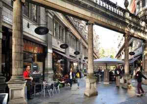

**2022 May** London Ruby User Group. Talks on Google Big Query integrations and COVID-19 response at GOV.UK digital services.

**2022 April** British Computer Society. Disagreements and disputes are common in our work and frequently play havoc with our neatly worked-out plans. Even when following an agile project lifecycle, stories delivered can fail to meet the expectations of the product owner and lead to rework, cost overruns and hurt feelings on both sides. It doesn't have to be so, if we can understand and mitigate the causes of our misunderstandings and disagreements. Renowned agile method pioneer Tom Gilb shares his advice with real-world examples both good and bad.

**2022 March** London CTO roundtable - Architecting teams that scale. No team structure is ever going to work 100% of the time, but companies who create a scalable workforce are likely to fare better through the changes and challenges that the Covid/post-Covid, remote/hybrid working era has brought. But how do you architect a team that will continue to be robust as you scale up? How can you keep hold of your top talent when times get tough? How will the demands on your team change as you go from 5 to 50 developers? And just how can you make architectural decisions with distributed and agile teams?

**2022 March** British Computer Society - The Future of IT Leadership. Do we need a complete reset of management methods? What do organizations' Boards need to understand about cybersecurity? Keeping up with the pace of change is a challenge in itself - so how will knowledge volatility affect the future of work? And we look at one of the major issues facing humanity now: how IT leaders need to take a lead on sustainability.

**2022 February** British Computer Society Software Testing specialist group (SIGIST). Mary Poppendieck and Tom Poppendieck authors of Lean Software Development: An Agile Toolkit share their experience on how approaches to quality have changed over the past 20 years.

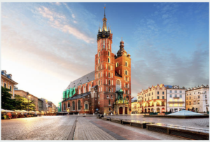

**2021 November** Becoming a Hacker: An Introduction to Ethical Hacking, Penetration Testing, and Bug Hunting. O'Reilly webinar on the fundamentals of Hacking and the latest trends today. WebSploit, Kali Linux, Parrot Security, Open Source Intelligence (OSINT), Vulnerability Scanning, Web Application Injection Attacks, Hacking Databases, Evasion and Post Exploitation Techniques.

**2021 June** CTO Craft Bytes - How to recruit and retain diverse talent. This fireside chat brought to you by CTO Craft will focus on hiring and retention by exploring strategies to attract diverse tech talent and foster a culture of diversity and inclusion.

**2021 May** CTO Craft Bytes - Modes of CTO success and failure. This panel discussion will define CTO ‘failure modes’ and ‘success modes’, with a focus on metrics, delivering value and how to effectively communicate this with your team.

**2021 April** Strategy for Technical Leaders - Bredemeyer Consulting. Workshop to learn about technical strategy using visual tools like Porter, Kaplan and Norton, Christensen, OKRs, Wardley. I joined a classroom of architects, product owners and product managers, senior designers, senior developers, CTOs and CIOs working together on the business cases provided.

**2021 February** London Ruby User Group. The February edition of the LRUG is a special one with lightning talks covering a broad range of topics. This edition we talked about statis site generators, Ruby Pathname, Reactors, awesome\_print and offline Rails.

**2020 November** QCon Plus. A virtual remote conference for senior software engineers on the trends, best practices and solutions seen in the industry. The highlights for me where the leadership approaches to microservices migration, GraphQL and security

**2020 July** Early Stage CTOs Meetup. In the age of COVID I attended a remote meetup within a small group of CTOs on how to set OKRs within startup teams.

**2020 June** London Ruby User Group. I gave a presentation on the mental models to help you choose when you should (or sometimes should not) use Agile using the lenses of risk management. The goal of the talk is to provide guidance for the puzzled business owner, project manager, or software developer who wants to pick what's right for their company or team.

**2020 March** Data Engineering Meetup. Talks on modern data architectures and how we can empower multiple autonomous teams while at the same time take control of our data asset.

**2020 February** London Data Science Journal Club. Gaussian Processes and Infinitely Wide Neural Networks.

**2020 February** London Ruby User Group. I presented a talk on Domain-Driven Observability.

**2020 February** ThoughtWorks Tech Radar presentation

**2019 November** Continuous Delivery in Machine Learning Workshop by Thoughtworks @ Chancery Lane, London

**2019 November** Big Data Conference London @ Olympia conference center, London

**2019 October** Negotiation Skills for IT leaders @ British Computer Society, London

**2019 September** We need to talk about statistics @ The Alan Turing Institute, London

**2019 July** Ruby Hacknight @ Simply Business office, London

**2019 July** VIM Meetup @ Lyft office, London

**2019 June** Clojure night @ Funding Circle office, London

**2019 May** µCon London 2019 - The Conference on Microservices, DDD & Software Architecture @ Angel, London

**2019 April** VIM Meetup @ Lyft office, London

**2019 April** Difficult Conversations @ British Computer Society

**2019 March** Elixir Meetup London

**2019 March** Cryptocurrencies, the issue of scalability @ London School of Economics Mathematics Department

**2019 March** Ruby Hacknight

**2019 February** ThoughtWorks Tech Radar presentation

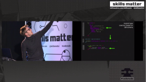

**2019 February** London Ruby User Group. I presented here _A different take on validation using the dry-validation gem_

**2018 November** Elixir Meetup London.

**2018 October** Ruby Unconference. I presented an event sourcing workshop here, check out the details on Github.

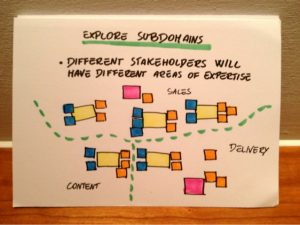

**2018 August** DDD London. Hands-on Domain Modelling with EventStorming.

**2018 July** Brighton Ruby. I gave a lightning talk on Event Sourcing here (short version of the one I gave at the London Ruby User Group in May 2018).

**2018 July** Finding and Removing Human biases in AI @ Imperial College London.

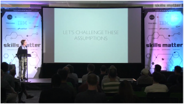

**2018 May** London Ruby User Grup @ SkillsMatter London. My presentation An Introduction to Event Sourcing for Rubyist is here.

**2018 April** DDD Exchange Conference @ Skillsmatter London

**2018 April** Ethereum meetup @ RISE London

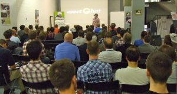

**2018 March** London Ruby User Group @ Skillsmatter London

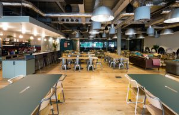

**2018 March** Hacker News @ London We Work Moorgate

**2018 March** Innovate Finance Global Summit @ London

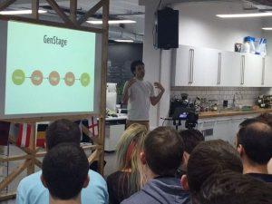

**2018 January** Elixir Meetup @ London

**2017 December** London Computation Club @ London

**2017 November** Innovate Finance CTO Forum @ London

**2017 November** DDD and Event sourcing workshop @ London

**2017 November** Automatic and precise program analysis for concurrent software @ Imperial College, London

**2017 November** Railsbank Open Banking API hackathon @ Startupbootcamp Fintech, London

**2017 November** GDG Devfest Conference @ UCL, London

**2017 October** Hacker news meetup @ Wework, London

**2017 September** EuRuKo, the European Ruby Conference @ Budapest, Hungary

**2017 August** Web Data Extraction: A Crash Course @ Imperial College, London

**2017 August** London Ruby User Group @ SkillsMatter, London

**2017 July** Brighton Ruby @ Brighton Dome

**2017 May** London Ruby User Group @ SkillsMatter, London

**2017 February** Mass Challenge Startups pitch night @ Tobacco dock, London

**2016 December** London Ruby User Group @ SkillsMatter, London

**2016 December** Startup Bootcamp Demo Day @ LINDLEY HALL, London

**2016 December** London Business Analytics Group - Machine Learning, What They Don’t Teach You At Coursera @ SkillsMatter, London

**2016 November** London Ruby User Group @ SkillsMatter, London

**2016 November** RubyConf @ Cincinnati, USA

**2016 October** London Ruby Unconference @ Carwow, London

**2016 October** Hack Works @ ThoughtWorks, London

**2016 October** Hacker News London @ Old Street, London

**2016 August** CrowdTuesday London - Blockchain applied to alternative finance @ BWB office, London

**2016 August** Technical Breakfast Club - Scaling up Rails in a national referendum @ Unboxed office, London

**2016 August** London Machine Learning Meetup @ Riverbank House, London

**2016 July** Summer School on Computational Complex and Social Systems @ Lipari Island, Sicily

**2016 June** Lead your Startup to Success @ Google Campus, London

**2016 June** PAPIs Machine Learning Workshop @ Moorgate, London

**2016 June** The Financial Services Club: The Chief Executive’s Challenges for the Challenger Banks @ Painters Hall, London

**2016 May** The Big O meetup - Real world Haskell and Gaussian Processes in F1 @ Skills Matter - CodeNode

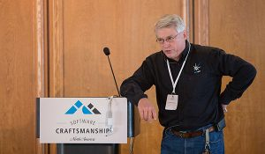

**2016 May** The Future of Programming with Robert C. Martin @ Skills Matter - CodeNode

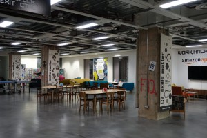

**2016 March** Cassandra London @ Skills Matter - CodeNode

**2016 February** Hack Summit @ the Internet

**2016 February** PyData London  @ Riverbank House, London

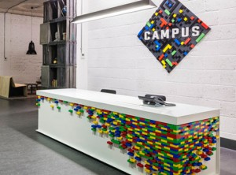

**2016 January** Applied AI Meetup @ Google Campus, London

**2015 December** Investing in Deep Learning Dinner @ Marylebone, London

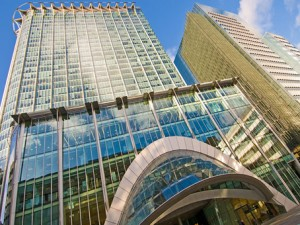

**2015 November** Fintech Tuesday Meetup @ Simmons & Simmons Law Offices, City Point

**2015 November** Recurrent Neural Networks with Attention and why they are so hard to train @ Myjar Ltd

**2015 November** Prediction Markets and Contextual Bandits @ Microsoft London

**2015 October** Introduction to Industrial Applications of Graphical Models @ The Shard

**2015 October** Bayesian Networks And The Search For Causality @ Lloyds Register

**2015 October** IP EXPO Europe @ Excel London

**2015 September** The London Big-O Meetup @ Skills Matter CodeNode

**2015 June** Google Next @ Tobacco Dock London

**2015 June** Startupbootcamp FastTrack session @ Rainmaking Loft St Katharine's Way

**2015 May** IC Tomorrow Financial Technologies Innovation Contest Final @ Canary Wharf London

**2015 May** Hacker News Meetup @ London Old Street

**2015 April** Data Science for Trends, Rail Streaming Data & Stateful Dataflows @ Queen Mary University London

**2015 April** 18th Machine Learning Meetup: Yoshua Bengio at UCL

**2015 April** AWS Summit 2015 @ ExCel London

**2015 February** Startup Bootcamp Fintechathon @ Rainmaking Loft London

**2015 January** Hacker News Meetup @ London Old Street

**2014 December** Cassandra Summit Europe @ London Park Plaza Riverbank Hotel

**2014 November** Machine Learning Meetup @ London Clerkenwell Road

**2014 October** Hacker News Meetup @ London Old Street

**2014 May** Scottish Ruby Conference @ Crieff Hydro

**2014 March** BackboneJS London @ Yammer office in Shoreditch London

**2014 March** Cassandra Training Session @ The Proud Archivist, London Regent's Canal

**2014 February** Amazon Web Services @ London

**2013 December** London Ruby User Group @ London

**2013 July** IBM Best Student Recognition Event 2013 @Montpellier

**2013 June** Ruby Day 2013 @Milano

**2013 May** MiSE 2013 @San Francisco

**2012 August** UML&FM 2012 @Paris

**2012 June** ICSE 2012 @Zurich

**2012 May** ISR Research Forum @UCI

**2011 September** LASER Summer School - Tools for Practical Software Verification @Elba

**2011 June** SAT/SMT Summer School @Boston

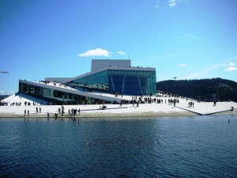

**2010 October** MODELS 2010 Conference @Oslo

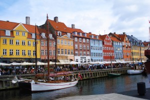

**2010 March** QMC 2010 Summer School @Copenaghen
